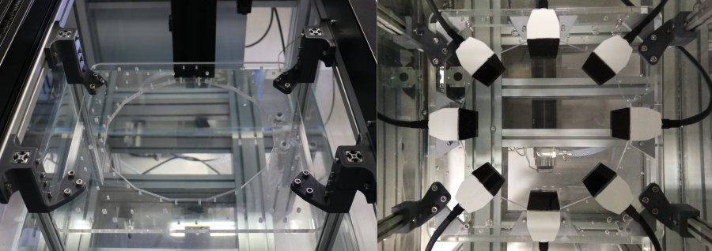

# 2D Ring Array Mounting Plate

This page is a work-in-progress and will be updated soon. 
It will provide guidance for the manufacture of the 2D ring array mounting plate assembly, which is used to hold the transducer modules in a water tank, in known positions relative to one another.

