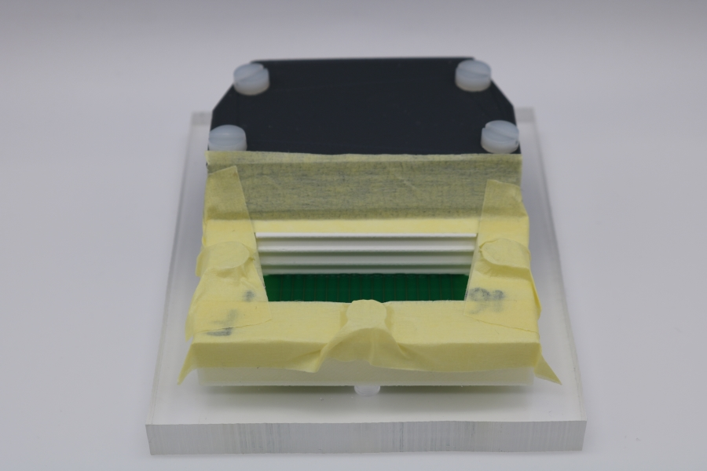
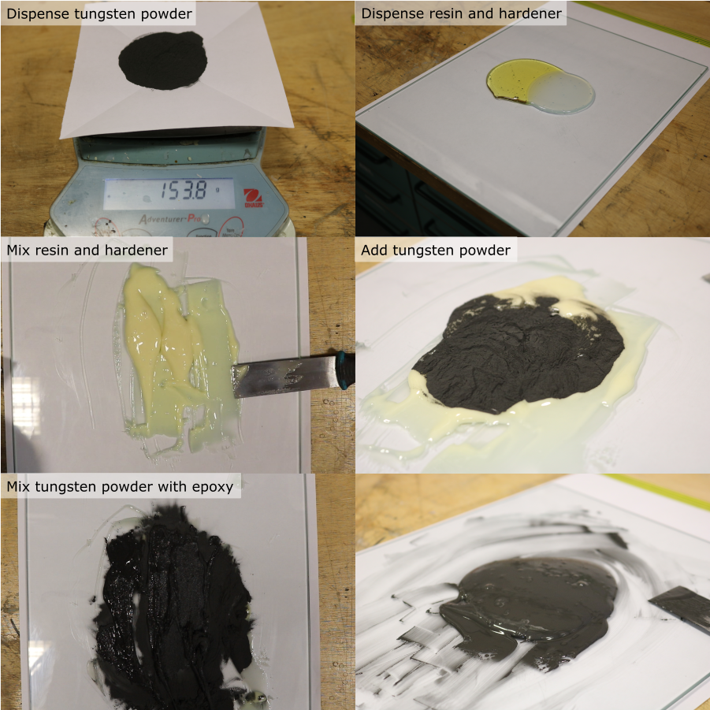
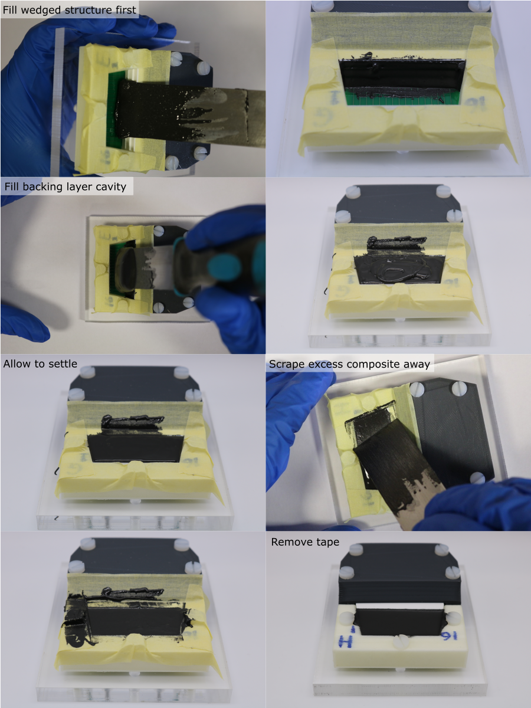
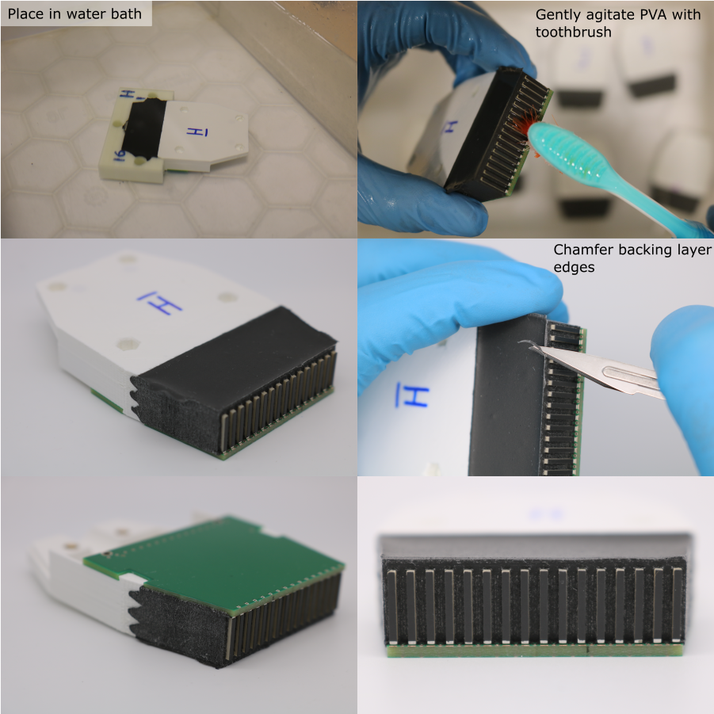

# Backing Layer Casting

## Mould Masking

Masking tape is used to remove excess composite after casting.

1. Cut four pieces of masking tape for each transducer module.
1. Place these smoothly around the backing layer cavity.

## Prepare Tungsten-Epoxy composite

1. Calculate the required mass of tungsten, resin and hardener. For four transducer modules, the required volume is 42 ml. For a tungsten-weight fraction of 80.8 %, the required quantities are:

| Component | Mass [g] |
|-----------|----------|
|Tungsten powder |153.79|
|Araldite standard resin |20.30|
|Araldite standard hardener |16.24|

Use the Matlab function `tungstenPolymerRatio` to calculate the masses needed for other volumes and compositions.

1. Place a clean piece of paper on a digital balance (resolution 0.1 g or better), and tare it.
1. Dispense the required mass of tungsten powder, place aside for later.
1. Clean the glass mixing plate with isopropyl alcohol.
1. Place the glass plate on the digital balance, and tare it.
1. Dispense the required mass of resin.
1. Tare the balance.
1. Dispense the required mass of hardener.
1. Remove the glass plate from the balance and clamp securely to the work surface.
1. Use a flat scraper to combine the resin and hardener. Mix thoroughly for 5 minutes, making sure that all of the material is fully incorporated.
1. Add the tungsten powder.
1. Mix thoroughly for 15 minutes, making sure that the mixture is homogeneous. Frequently remove unmixed material from the scraper and the edges of the glass plate, using a safety blade, and combine it with the rest of the material.

## Composite Casting

1. Collect ~3 ml of composite on the end of the scraper.
1. First dispense the composite onto the wedged scattering structure on the front end of the transducer housing. Push the composite into the wedged cutouts so that they fill completely.
1. Next, slightly overfill the remaining backing layer cavity with composite. 
1. Remove the excess composite by sliding the scraper blade along the top surface of the housing and alignment mould. Do this in both directions, with the blade angled towards the direction of travel.
1. To fully remove the excess composite, carefully pull away the masking tape.
1. Allow the composite to cure for 24 hours.

## Alignment Mould Removal

**Note:** Residual PVA can be gently removed from between the PZT elements using a toothbrush. Do not use warm water or agressive agitation since this can warp the housing, and damage the adhesive bond between the PZT and the matching and backing layers.

1. Remove the nylon screws that hold the module assembly to the base plate.
1. Transfer any module identification labels from the alignment mould to the housing using a permanent marker.
1. To dissolve the PVA alignment mould, place the module assembly in a bath of room temperature water for ~36 hours.
1. After dissolving the alignment mould, rinse in clean water and pat dry with a paper towel.
1. Once dry, use a scalpel to create a chamfer on the edges of the backing layer.

