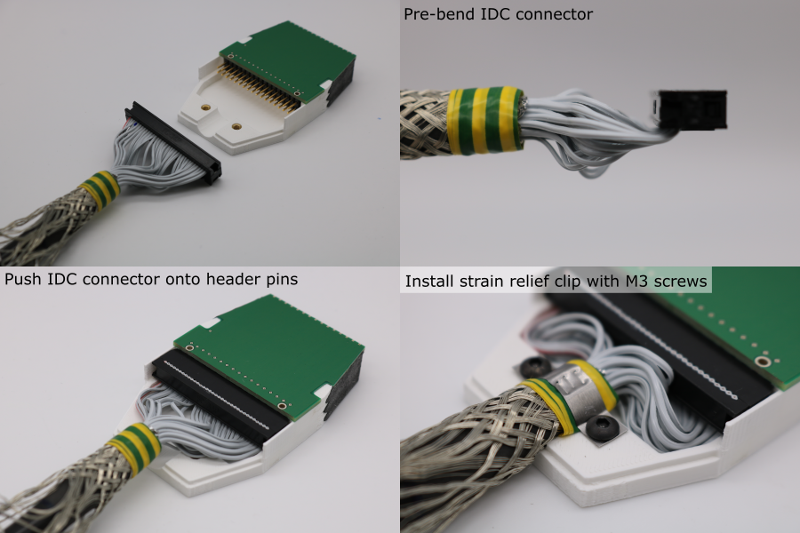
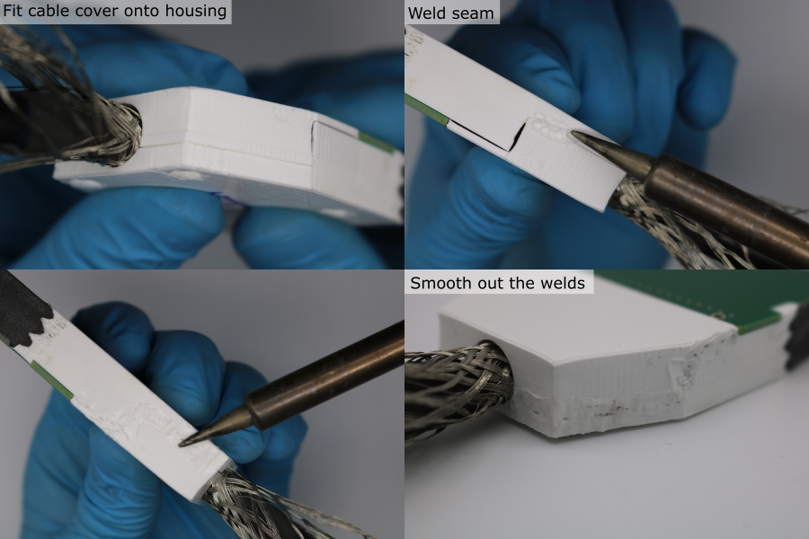

# Cable Installation

## Installation

1. Identify the transducer end of the cable.
1. Pre-bend the IDC connector so that the sockets are coaxial with the cable.
1. Hold the cable so that the polarity indicators (embossed triangle / red wire) are on the left.
1. Push the IDC connector onto the PCB header pins.
1. Secure the cable to the transducer housing using the strain rleief clip and M3 x 5 mm socket head screws. Make sure the clip grips the sheathed part of the cable, and not the individual wires.

## Cable Cover Welding

1. 3D-print the cable cover (orientation and slicer settings detailed in [3D-print-spec.pdf](https://github.com/morganjroberts/open-UST/blob/main/hardware-distribution/3D-print-spec.pdf)).
1. Setup a soldering iron with a temperature of 275 °C and a very clean tip. Setup an extraction fan.
1. Hold the cover piece in place. Make sure that the copper braid is not caught in the cover-housing seam.
1. Tack weld the cover-housing seam using the soldering iron.
1. Fully weld the cover-housing seam, pushing the tip deep into the seam to achieve good penetration.
1. Smooth out the welded seam using the soldering iron tip.

