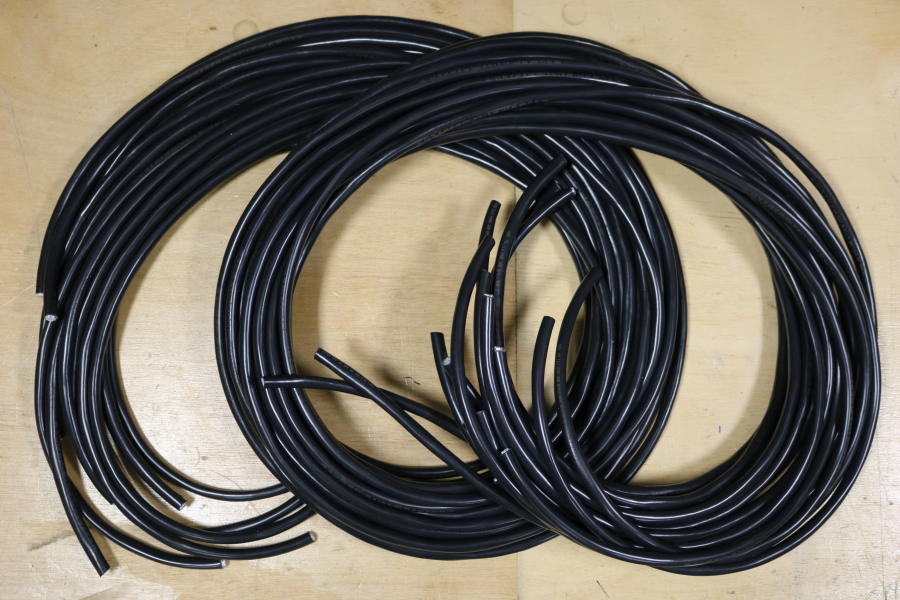
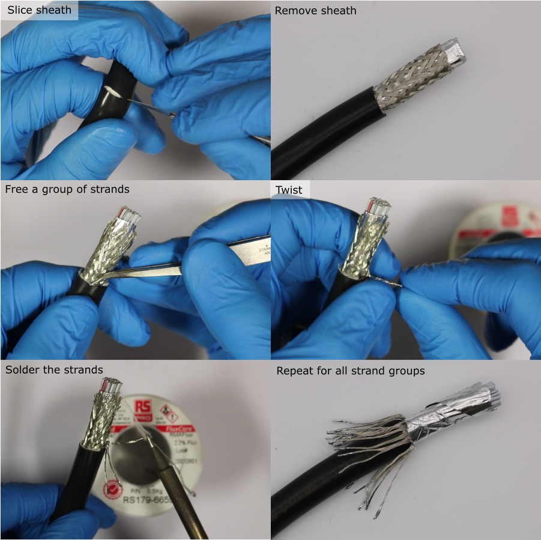
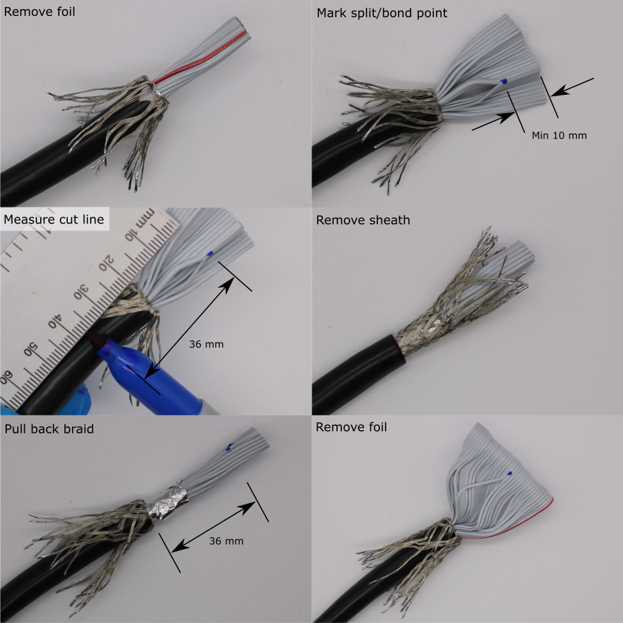
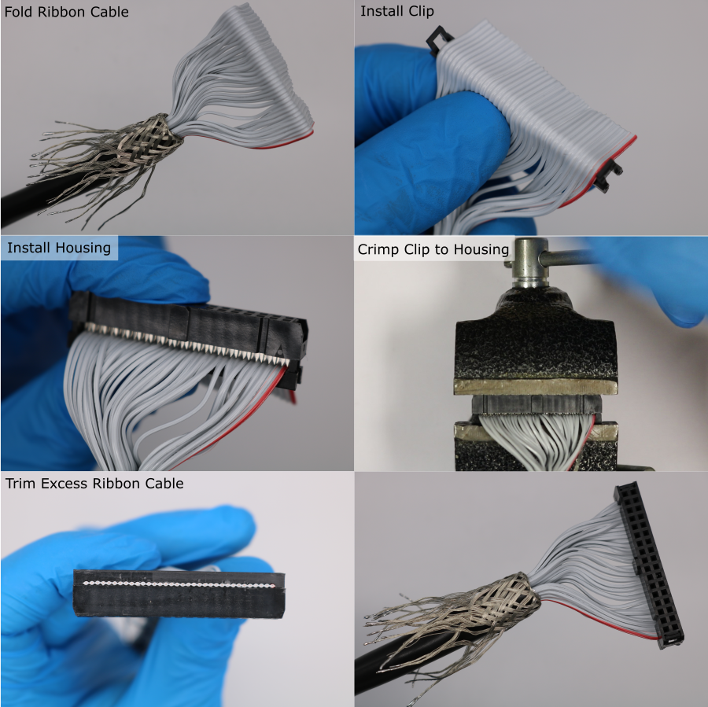
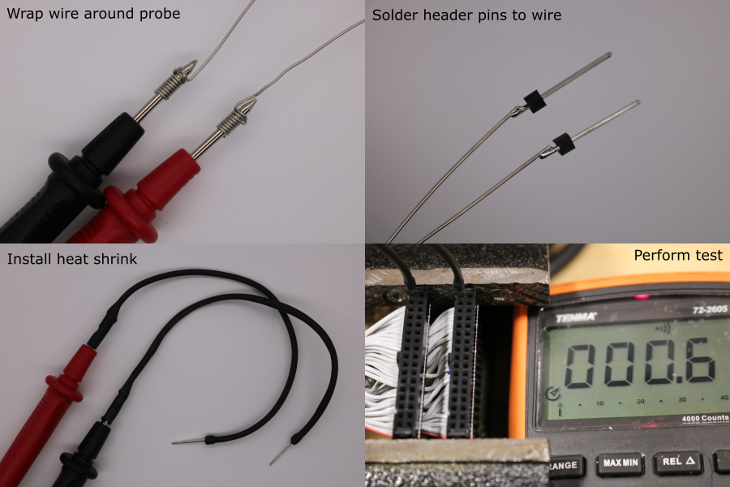
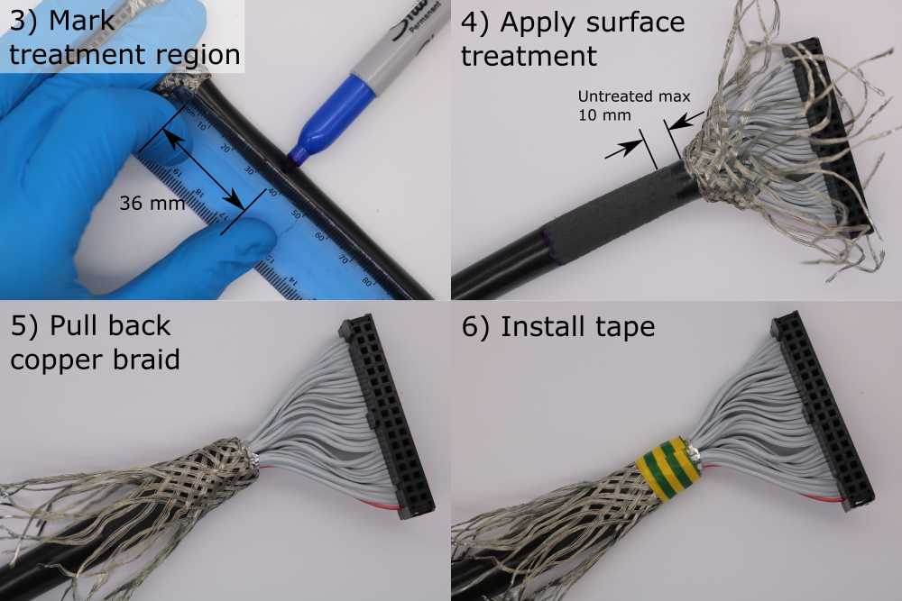
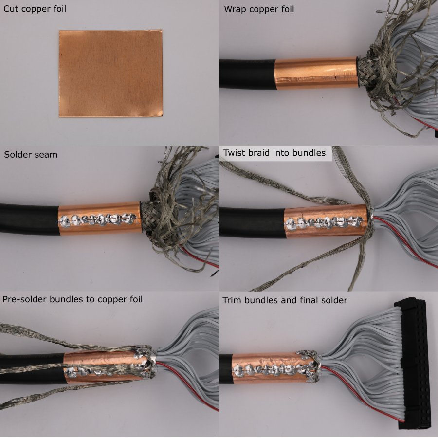

# Cable Preparation

A shielded round ribbon cable is used to connect each transducer module to the data acquisition system. The ends of each cable must be prepared by installing an insulation-displaement-contact (IDC) connector, and by terminating the copper braid.

## Cut Cable to Length

* Cut enough cable so that there is enough slack when the transducer modules are connected to the data acquisition system, and placed in the water tank.
* For this system, 2.3 m was the required length.
* Up to 122 mm of cable may need to be removed when the sheath length is adjusted (see below).
* To account for this the cables were cut oversized, to lengths of 2.5 m.

## Braid Preparation

The cable braid is made from groups of strands that are woven together. To prevent the braid from becoming untangled later, each group of strands should be terminated with solder.

1. Setup a soldering iron with a temperature of 350 °C and a small tip.
1. Remove 25 mm of sheath using a scalpel. Bend the cable to put tension on the sheath. Use a fresh, sharp blade with light, shallow strokes. Take care not to cut the braid wires underneath the sheath. 
1. For a group of braid strands, use tweezers to pull the group free from the braid.
1. Twist the end of the group together.
1. Apply a small amount of solder to the end of the group of strands.
1. Bend the group of strands down.
1. Repeat for all groups of braid strands.

## Adjusting the Sheath Length

The length of ribbon cable between the end of the sheath and the IDC connector should be 36 mm \( \pm \) 5 mm. Deviations from this will make it difficult to install the cable into the transducer module later.

The ribbon cable has a continuous split/bonded repeating pattern, where the split sections are 36 mm in length, and the bonded sections are 25 mm in length , detailed in [`3M-3659-3_34-way-screened-round-ribbon-cable_datasheet.pdf`](https://github.com/morganjroberts/open-UST/blob/main/hardware-distribution/technical-datasheets/3M-3659-3_34-way-screened-round-ribbon-cable_datasheet.pdf))

The IDC connector is installed on the bonded section. The end of the sheath should be aligned with the point where the ribbon cable changes from bonded to split (moving towards the end of the cable). This will provide approximately 36 mm of cable between the end of the sheath and the IDC connector. 

1. Use a scalpel to remove the foil, exposing the ribbon cable.
1. Mark the transition point where the ribbon cable changes from split to bonded (moving towards the end of the cable) using a permenant marker. If this point is not visible, remove sheath in small increments until it is visible. There must be at least 10 mm of bonded section for installing the IDC connectors. If there is less than 6 mm, remove more sheath to find a new transition point.
1. Make a mark 36 mm back from this transition point, using a permenant marker.
1. Use a scalpel to remove the remaining sheath up to this mark.
1. Pull back the braid to expose the foil.
1. Use a scalpel to remove the foil, exposing the ribbon cable. Verify that the end of the sheath is aligned with the point where the ribbon cable changes from bonded to split (moving towards the end of the cable).

## Installing the Connectors

1. Orient the cable so that the red wire is on the right hand side.
1. Pre-flatten the ribbon cable by folding it approximately 6 mm above the transition from split to bonded.
1. Install the IDC clip underneath the cable. 
1. Install the IDC housing onto the IDC clip. Press the two parts together until the IDC contacts grip the ribbon cable. Make sure that the polarity indicator (embossed triangle) is on the right hand side. The tab should also be facing forwards. Make sure the individual conductors are well aligned with the clip indentations and the IDC contacts.
1. Use a vice to compress the assembly until the IDC clip locks to the IDC housing.
1. Use side cutters to trim the excess ribbon cable flush with the IDC connector.

## Test Continuity and Isolation

The IDC connector installation should be verified at this point, to prevent further manufacture on a bad cable, which would have to be repeated once the fault is detected.
Conductor continuity along the cable is tested, in addition to isolation between neighbouring conductors.

1. Find a multimeter with probes that are compatible with the IDC socket.
1. If necessary, incompatible multimeter probes can be modified:
    * Cut 2 lengths of 120 mm solid core 28 awg wire.
    * Wrap one end tightly around each multimeter probe, using a knot.
    * Obtain two single header pins with 0.64 mm sqaure posts.
    * Solder each pin to the other end of the wire.
    * Cut a 120 mm length of heatshrink.
    * Install the heatshrink and shrink it onto the extended probe.
1. Hold the IDC connectors from each end of the cable in a vice. Make sure their orientation is the same.
1. Use the multimeter probes to test continuity and isolation according to the pattern shown in diagram below.
    * For continuous measurements the DC resistance should be \( < 1 \Omega \).
    * For isolated measurements the DC resistance should be out-of-range.

## Sheath Surface Treatment for Bonding (Transducer End)

During the coating process, an adhesive bond to the PVC cable sheath is required. It is difficult to bond to PVC, so an abrasive surface treatment is used to increase bond strength.

1. Choose the end of the cable with the longest copper braid. This will be the transducer end of the cable.
1. Pull the copper braid back over the IDC connector.
1. Make a mark 36 mm from the end of the sheath using a permenant marker. Extend the mark around the sheath circumference.
1. Use a 24 tpi hacksaw blade (or similar) to abrade the cable sheath. The shiny PVC surface should be completely removed. Surface treatment should be applied up to at least 10 mm from the end of the sheath.
1. Pull the copper braid back over the sheath.
1. Wrap the end of the sheath in electrical insulating tape. The tape width should be \(\leq \) 14 mm.

## Sheath Copper Coating for Shield Termination (Plug End)

1. Cut a rectangle of adhesive-backed copper foil using scissors. The length of the collar should be 30 mm.
2. Wrap the copper foil around the plug end of the cable, and rub the seam.
3. Setup a soldering iron with a high temperature of 380 degC and a large-area tip.
4. Apply solder to the copper foil seam.
5. Use tweezers to untangle the copper braid.
6. Form 4 twisted bundles of copper braid, equally spaced around the cable circumference.
7. Bend one of the bundles so that its base touches the copper foil.
8. Pre-solder the base of a bundle.
9. Cut the bundle so that it overlaps the copper foil by ~ 4 mm.
10. Solder the trimmed bundle to the copper foil. Keep heating time to a minimum to avoid melting the PVC cable sheath.
11. Repeat this process for all four bundles.

