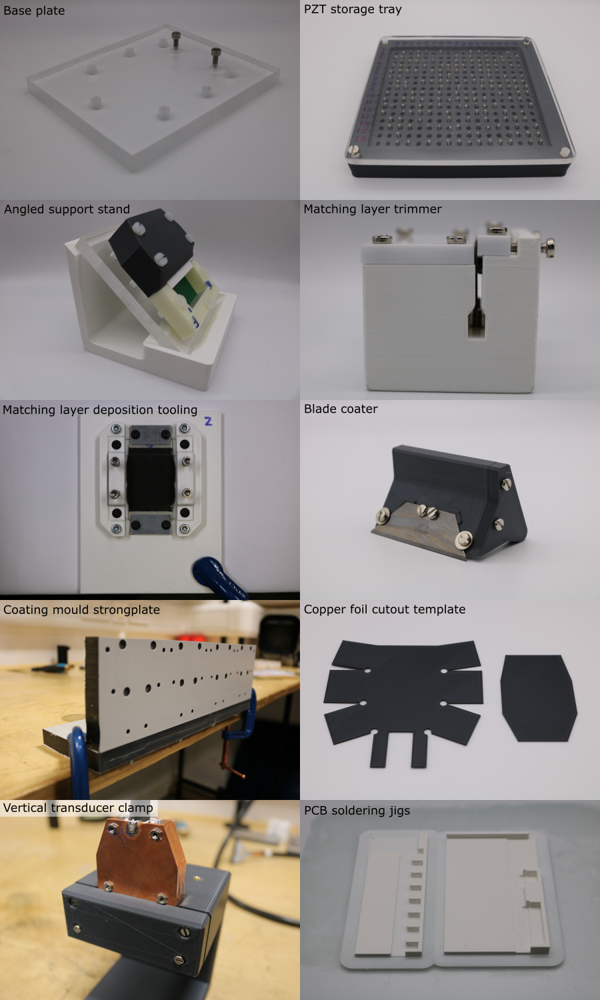

# Custom Tooling Manufacture

Custom tooling has been designed to enable the low cost manufacture of the open-UST transducers:

- Base plate assembly
- PZT storage tray
- Angled support stand
- Matching layer trimmer
- Matching layer deposition tooling
- Blade coater
- Coating mould strongplate
- Copper foil cutout template
- Vertical transducer clamp
- Breakout PCB soldering jig
- Cable mount PCB soldering jig

Pages in this section are a work-in-progress, and will soon be populated with guidance on how to manufacture these parts.

