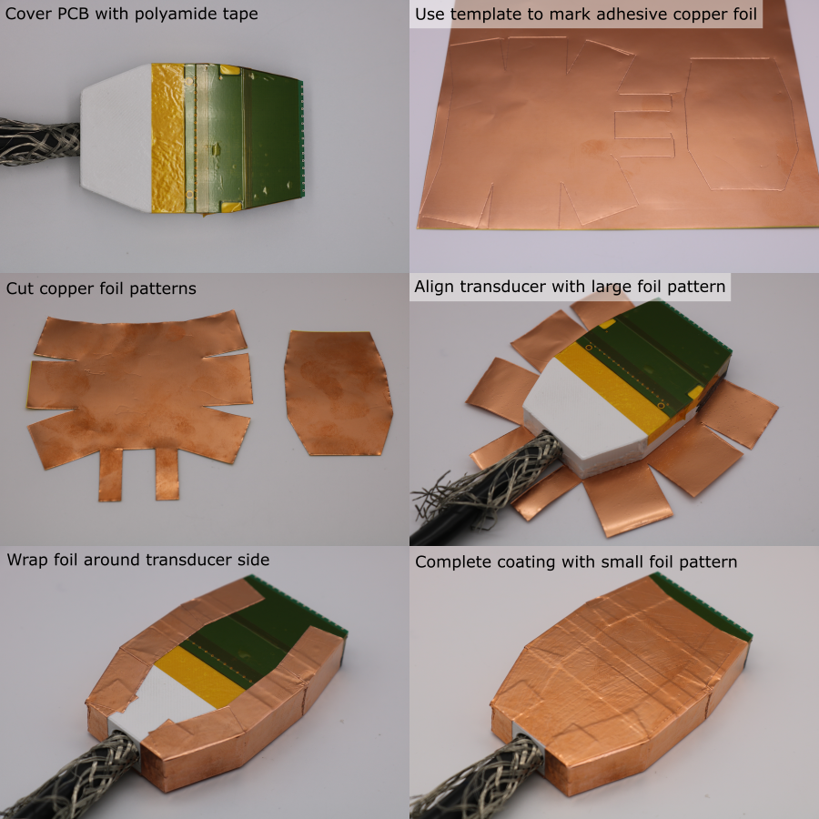
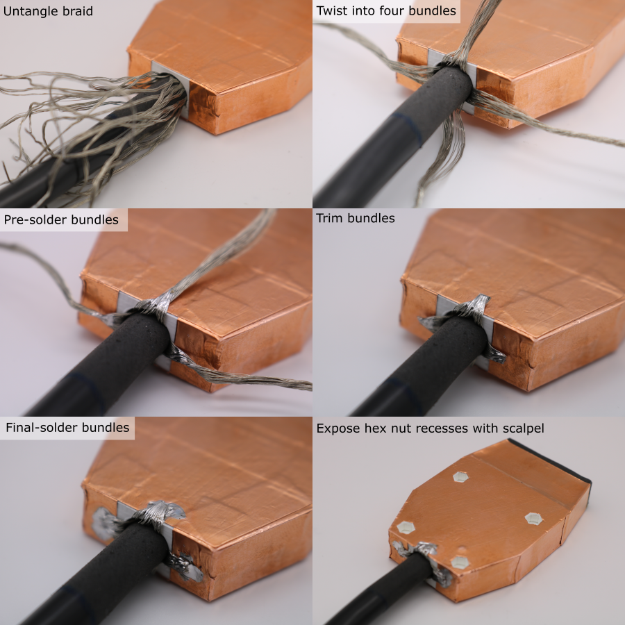

# Electromagnetic Shielding

## Install copper foil

1. Cut x3 50 mm strips of insulating polyamide tape.
1. Cover the exposed transducer PCB with the tape overlapping.
1. Manufacture the copper foil template pieces (further details [here](custom-tooling-manufacture.md)).
1. Trace the outline of the template pieces on a piece of adhesive-backed copper foil.
1. Cut out the copper foil pattern using scissors.
1. Place the transducer module on the larger copper foil pattern, with the PCB facing up.
1. Wrap the side tabs around the transducer module.
1. Place the smaller copper foil pattern on the PCB side of the transducer module.
1. Rub the copper foil all over with a hard stick so that the adhesive creates tight seams. 

## Bond Cable Braid to Transducer Shield

1. Use tweezers to untangle the copper braid.
1. Form 4 twisted bundles of copper braid, equally spaced around the cable circumference.
1. Bend one of the bundles so that its base touches the copper foil.
1. Pre-solder the base of the bundle.
1. Cut the bundle so that it overlaps the copper foil by ~4 mm.
1. Solder the trimmed bundle to the copper foil. Keep heating time to a minimum to avoid melting the transducer housing.
1. Repeat this process for all four bundles.
1. Use a scalpel to cutout x4 hexagons, exposing the mounting nut recesses.

