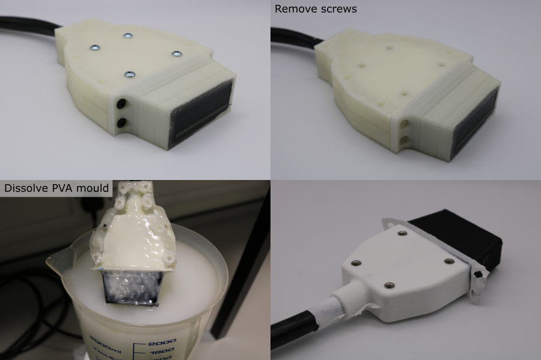
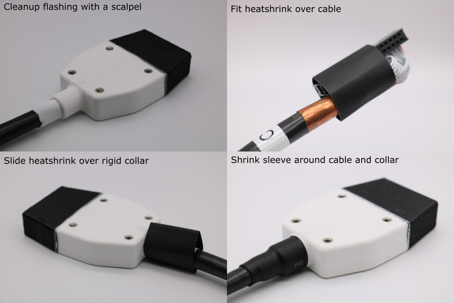

# Finishing

## Dissolve Moulds

1. Remove the transducer module from the coating strong-plate.
1. Remove all of the screws from the coating moulds.
1. Place place the transducer-mould assembly in a bath of room temperature water for ~36 hours.
1. Pull away the silicone sealant from the cable.
1. After dissolving the mould, rinse in clean water and pat dry with a paper towel.

**Note:** Do not use warm water or agressive agitation since this can warp the internal plastic parts and damage the adhesive bond between the thin polyurethane coating and the transducer.

## Bend Relief Installation

1. Use a scalpel to remove the thin flashing created by the coating mould seams.
1. Cut a 32 mm piece of heatshrink using a pair of scissors.
1. Thread the heatshrink over the cable.
1. Pull the heatshrink over the collar where the cable enters the transducer module.
1. Hold the cable so that it is straight as it enters the transducer.
1. Use a heatgun to gently heat the sleeve, starting from the collar end. Heat from all directions, and allow the transducer to cool if the coating becomes too hot to touch.
1. Allow the heatshrink to cool fully before bending the cable.
1. The transducer module is now finished.

