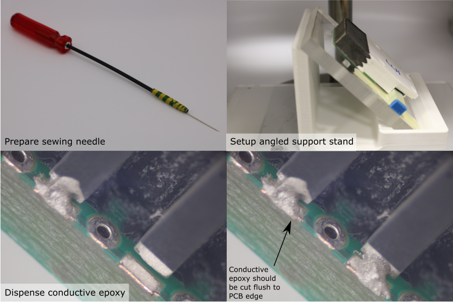

# Front Electrode Connection

1. Use an air duster to remove and debris from the front electrode pads.
1. Prepare diluted conductive epoxy using the process described [earlier](rear-electrode-connection.md#conductive-epoxy-preparation).
2. Place the module assembly on the angled support plate, under a microscope.
3. Prepare a dispensing tool - attach a sewing needle to a long rod using tape.
4. Collect a drop of diluted conductive epoxy on the needle tip.
5. Place the drop on the PCB pad, and move the needle tip in small circles so that the drop touches the front electrode. The conductive epoxy should form a smooth fillet.
6. Repeat this process for all PZT elements in the transducer module.
7. Allow the conductive epoxy to cure for 24 hours.
8. Inspect the joints. Make sure that the conductive epoxy joints are flush with the edge of the PCB. If any of them overhang, use a new sharp scalpel blade to remove the excess material. 

