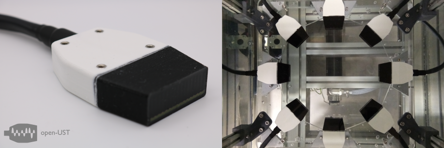

# open-UST

This is the documentation for the [open-UST](https://github.com/morganjroberts/open-UST) hardware distribution: an open source manufacturing framework for a low-cost, modular Ultrasound Tomography (UST) research system.

This documentation, and the hardware github repository, are both being actively updated. 

Progress tracker:

| Task | Status |
|------|-------|
|Prototyping | Complete | 
|Batch 1 Manufacture (x8 modules) | Complete |
|Batch 1 Acoustic Evaluation | In Progress |
|Batch 2 Manufacture (x8 modules) | In Progress |
|Combine Batch 1 & 2 (x16 modules), do UST phantom imaging | Not started |