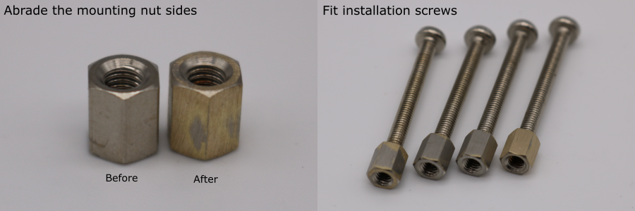
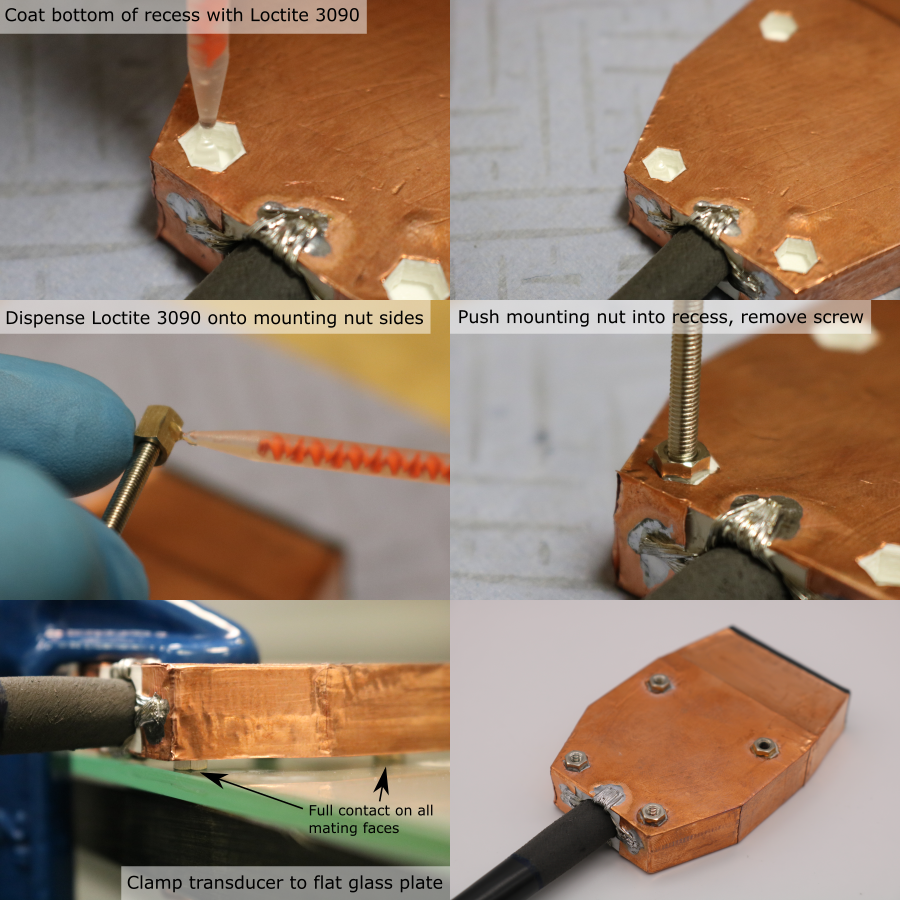

# Install Mounting Nuts

## Overview
abrading
glass plate clamping to ensure the ends of the mounting nuts are coplanar

## Mounting nut preparation

1. Tape a piece of P180 grit sandpaper to a flat glass plate
2. Abrade each side of the mounting nut by holding it flat against the sandpaper and rubbing in a figure-of-8 pattern. 
3. Put the mounting nuts in a bath of isopropyl alcohol and agitate to degrease them.
4. Thread each mounting nut onto an M3 x 30 mm screw. The threads should engage by ~ 4 mm.

## Mounting nut installation

Note: the Loctite 3090 has an extremely short work time, so these steps must be performed very quickly. Make sure that the supplies are prepared before starting, and use two operators.

1. Setup a glass plate on the edge of a workbench and prepare some small G-clamps.
2. Place the transducer module on a flat surface, with the mounting nut recesses facing up.
3. Fit a nozzle to the Loctite 3090 syringe barrel, squeezeout ~ 0.5 ml of adhesive and discard it.
4. Quickly, dispense a small drop of Loctite 3090 into the bottom of the mounting nut recess. 
5. Spread it around with a wooden cocktail stick to cover the entire bottom face.
6. Dispense Loctite 3090 on to all six sides of the mounting nut.
7. Push the mounting nut into the recess, and remove the screw.
8. repeat this for all 4 mounting nuts in the transducer module.
9. Clamp the transducer module to the glass plate using a small G-clamp, with the mounting nuts facing down. Make sure that the end of each mounting nut is flat against the glass.
1. Allow the adhesive to cure for 1 hour before removing the transducer from the glass plate.

