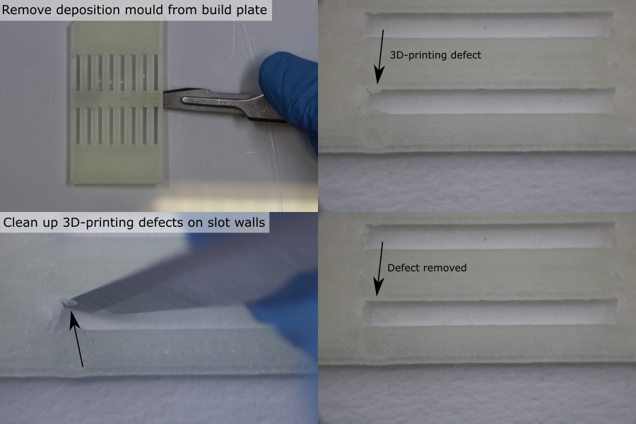
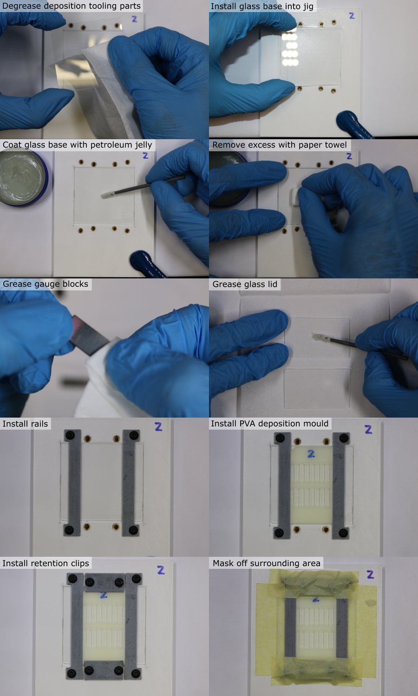
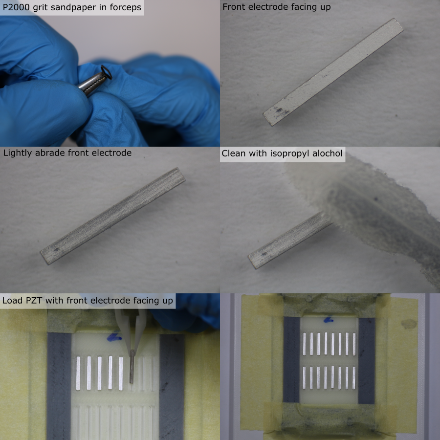
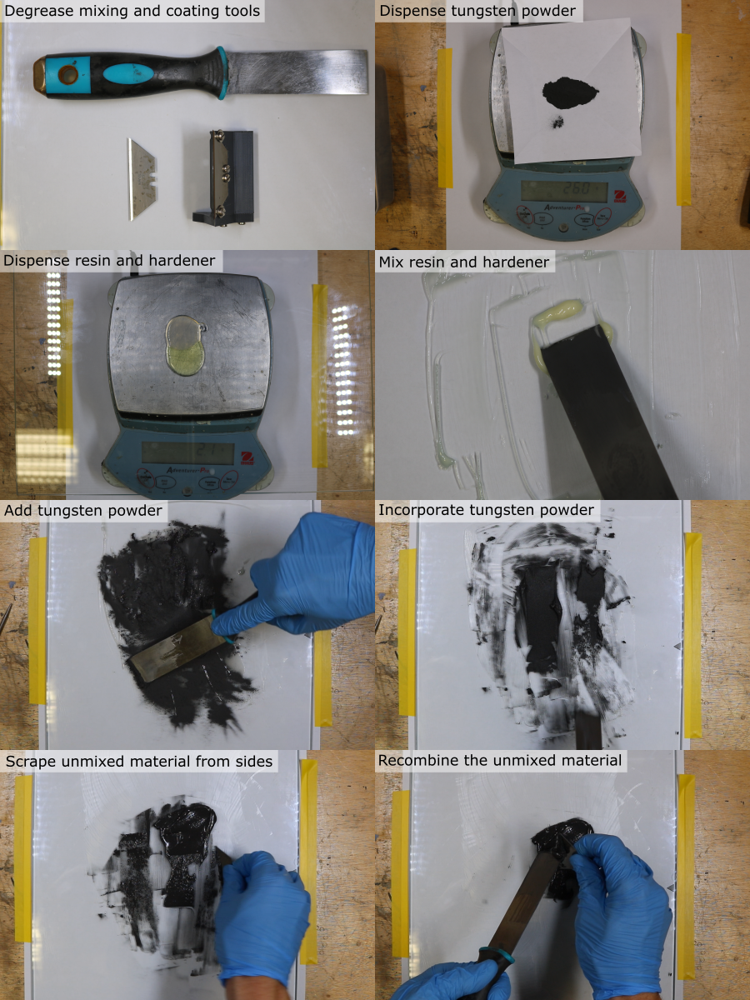
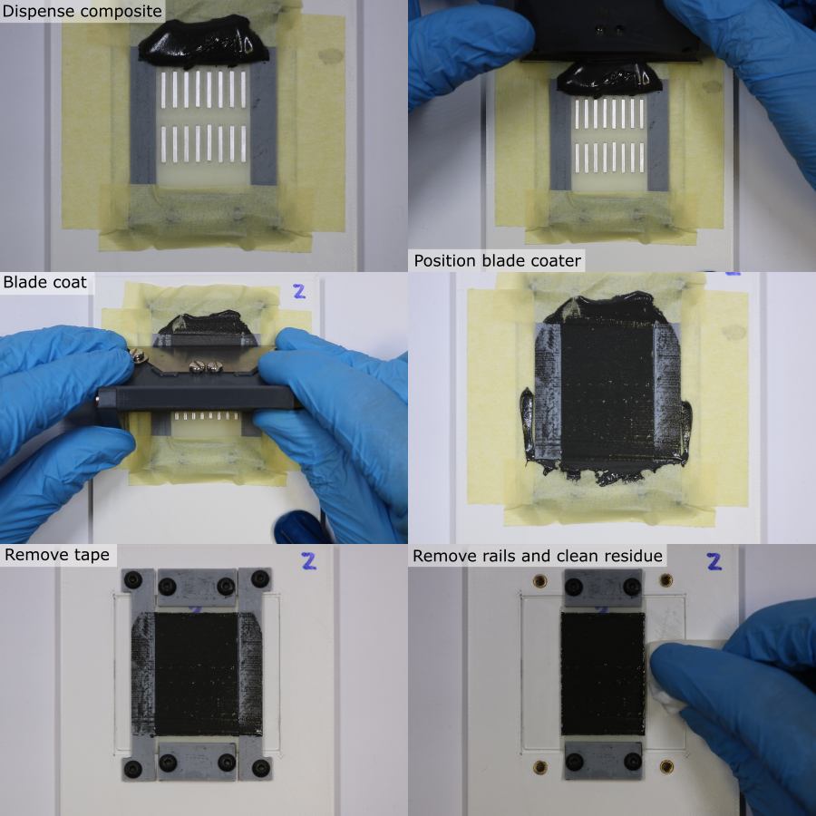
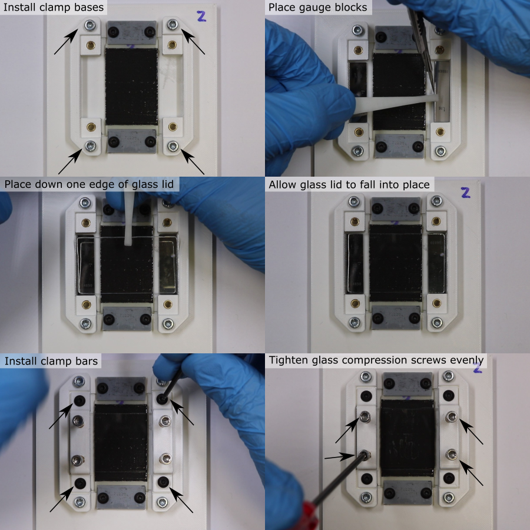
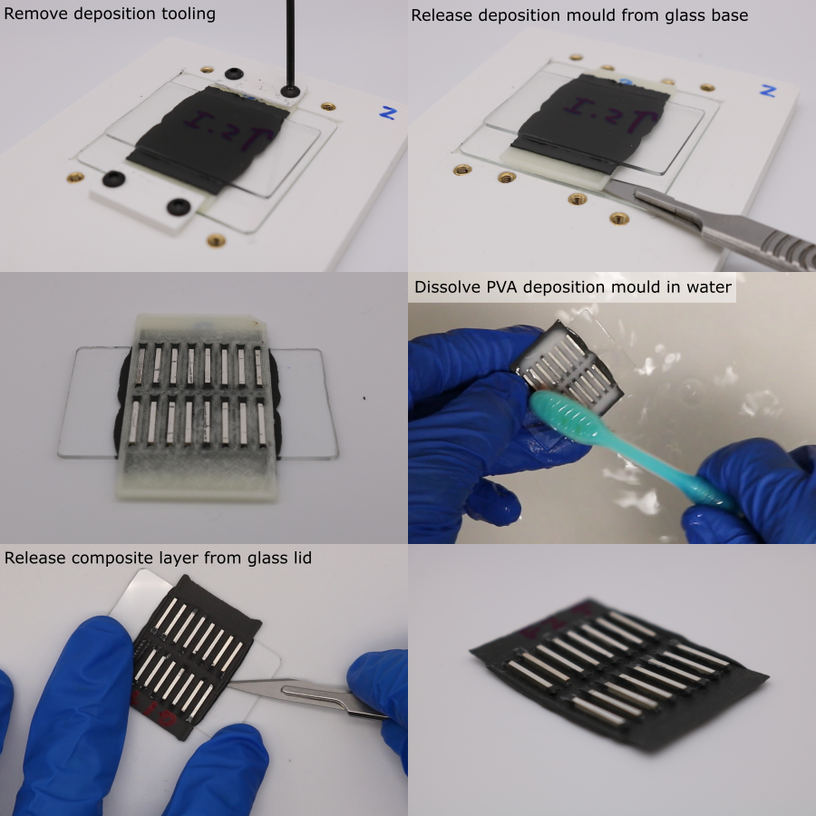
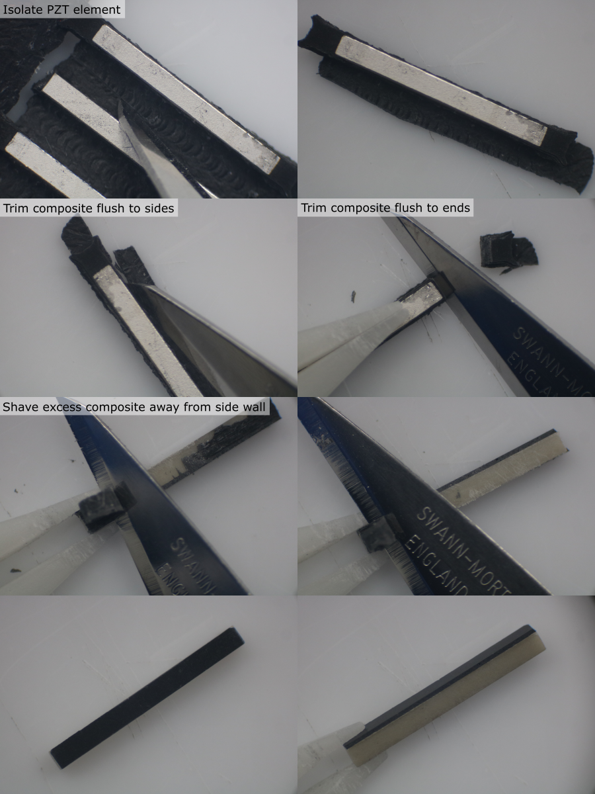
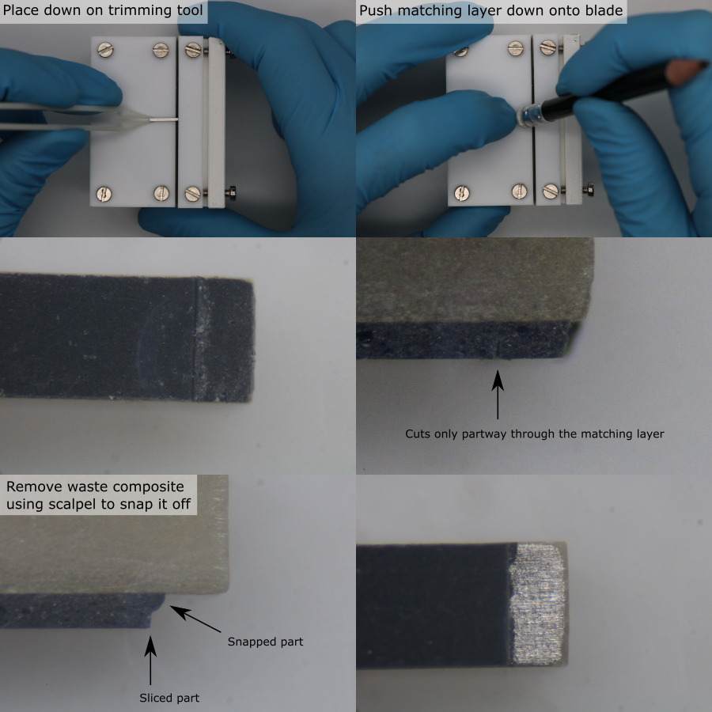

# Matching Layer Deposition

## Prepare PVA Deposition Mould

1. From the width ordered list of PZT elements, select a batch of 20 PZT elements with a similar width, and make a list of their PZT ID's.
1. Calibrate the slot width for the PVA deposition mould, (offset calibration process described [here](dimension-calibration-3D-printing.md#deposition-mould)).
1. 3D-print the PVA deposition mould for the current batch (orientation and slicer settings detailed in [3D-print-spec.pdf](https://github.com/morganjroberts/open-UST/blob/main/hardware-distribution/3D-print-spec.pdf)).
1. Allow the part to cool for 1 hour.
1. Carefully remove the part from the glass build plate using a scalpel.
1. Inspect the slots under a microscope. Remove any debris using a scalpel and an air duster.

## Prepare Deposition Tooling

1. Manufacture the deposition tooling parts (further details [here](custom-tooling-manufacture.md)).
1. Remove debris from the deposition tooling parts using an air duster.
1. Degrease the deposition tooling parts using a paper towel/foam swab and isopropyl alcohol.
1. Use a foam swab to apply a coating of petroleum jelly to both sides of the steel gauge blocks, and to one side of each of the glass pieces.
1. Wipe off the coating using a paper towel to leave only a very thin layer that has negligible thickness.
1. Clamp the jig to the work surface using a small G-clamp.
1. Place the glass base into its recess, with the greased side facing up.
1. Install the coating rails and loosely install the M3 x 6 mm screws.
1. Place the PVA deposition mould onto the glass plate, in the same orientation that it was 3D-printed.
1. Install the retention clips and loosely install the M3 x 6 mm screws.
1. Adjust the parts so that there is no gap between the rails and the PVA deposition mould.
1. Tighten all the screws until the parts are fixed in place, but no further (to avoid flexing).
1. Place strips of masking tape on the glass plate beside the rails, and on the retention clips.

## Prepare and Load PZT elements

**Note:** PZT element electrodes are polarised, and come from the manufacturer with a polarity indicator (e.g. an ink marking). Polarity affects whether the PZT generates a positive or negative pressure wave when driven with a positive voltage pulse, and should be the same for all the elements in the array. Polarity errors can be identified during calibration, and corrected for with the driving voltage, but it is more convenient to make sure that the PZT elements are loaded into the deposition mould with the same polarity.

1. Identify the PZT element ID for the first deposition mould slot position, and remove the PZT element from the PZT storage tray using tweezers.
1. Find the side without a polarity indicator. This is the 'front electrode', and the composite will bond to this side.
1. Under a microscope, lightly abrade the surface of the front electrode using a small piece of P2000 grit sandpaper held in a pair of forceps. Do not remove excessive material.
1. Clean all faces of the PZT element using isopropyl alcohol and a foam swab.
1. Use tweezers to place the clean PZT element into the deposition mould slot, with the front electrode facing up. Make sure the PZT element is in full contact with the glass plate.
1. Repeat for all elements in the batch. Make sure that the location of each unique PZT ID within the deposition mould slots is recorded.

## Prepare Tungsten-Epoxy Composite

First calculate the required mass of tungsten, resin and hardener. For one batch of 20 PZT elements, the required volume is 5 ml. For a tungsten-weight fraction of 86.7 %, the required quantities are:

| Component | Mass [g] |
|-----------|----------|
|Tungsten powder |25.98|
|Araldite standard resin |2.18|
|Araldite standard hardener |1.74|

Use the Matlab function `tungstenPolymerRatio` to calculate the masses needed for other volumes and compositions.

1. Place a clean piece of paper on a digital balance (resolution 0.1 g or better), and tare it.
1. Dispense the required mass of tungsten powder, place aside for later.
1. Clean the glass mixing plate with isopropyl alcohol.
1. Place the glass plate on the digital balance, and tare it.
1. Dispense the required mass of resin.
1. Tare the balance.
1. Dispense the required mass of hardener.
1. Remove the glass plate from the balance and clamp securely to the work surface.
1. Use a flat scraper to combine the resin and hardener. Mix thoroughly for 5 minutes, making sure that all of the material is fully incorporated.
1. Add the tungsten powder.
1. Mix thoroughly for 15 minutes, making sure that the mixture is homogeneous. Frequently remove unmixed material from the scraper and the edges of the glass plate, using a safety blade, and combine it with the rest of the material.

## Blade Coating Composite

**Note:** Only one coating stroke should be used. Practice this step first with an empty deposition mould to gain experience of how the composite behaves and how much is required.

1. Clean the custom blade coater using a foam swab and isopropyl alcohol.
1. Carefully place ~3 ml of composite above the first row of PZT elements, on the deposition mould. Do not allow the composite to touch the elements, as this can pull them up out of their slots.
1. Place the blade coater down onto the rails so that the composite is underneath the tool.
1. Slowly (~0.6 mm/s) drag the blade along the rails to coat the PZT elements with the composite. Make sure that even pressure is applied to the three points of contact between the blade coater and the rails/jig.
1. At the end of the coating stroke, slowly detach the blade from the composite using a side-to-side motion.
1. Remove the masking tape, being careful not to touch the coating layer.
1. Remove the rails, being careful not to touch the coating layer.
1. Use a paper towel and isopropyl alcohol to remove residue from the parts of the glass base previously covered by the rails and tape.

## Composite Compression

1. Place the 2 clamp bases either side of the deposition mould.
1. Install the M3 x 12 mm screws and tighten until the clamps are fixed in place, but no further (to avoid flexing).
1. Use tweezers to place the steel gauge blocks in their recesses, either side of the deposition mould. Be very careful not to touch the coating layer.
1. Use tweezers to place one edge of the glass lid down so that it touches both gauge blocks. Once it touches the composite, do not lift it up.
1. Allow the glass to fall into place onto the gauge blocks. The greased side should be touching the composite.
1. Fix the clamp bars to the clamp bases using M3 x 6 mm screws.
1. Insert the M3 x 20 mm clamping screws into the clamp bar, and advance them so that they almost touch the glass lid.
1. In sequence, compress the composite layer. Tighten the four screws a quarter-turn at a time, to apply even clamping pressure. Stop once the glass lid touches the gauge block.
1. Label the glass lid with the batch ID using a permananent marker.
1. Allow the composite to cure undisturbed for 24 hours.

**Note:** During the manufacture of the transducers, there were major problems compressing the composite, due to the high viscosity of the composite. The high shear forces required were not achievable by clamping the glass plates, since they flexed and cracked. In future, thicker glass could be used, the clamping force could be spread over a larger area, and the blade coating thickness could be reduced. This custom tooling requires modification, which is an open issue on GitHub.

## Mould Removal

**Note:** Residual PVA can be gently removed from between the PZT elements using a toothbrush. Do not use warm water or agressive agitation since this can damage the adhesive bond between the PZT and the composite.

1. Dissasemble the coating tooling.
1. Use a scalpel to gently release the PVA deposition mould from the glass base. Do not attempt to remove the glass lid.
1. To dissolve the PVA deposition mould, place the glass-PZT-PVA assembly in a bath of room temperature water for ~36 hours.
1. Place the glass lid on a flat surface with the PZT elements facing up.
1. Use a scalpel to gently release the composite from the glass lid. Work slowly, from the outside inwards, from all directions.

## Matching Layer Trimming

**Note:** Change the scalpel blade for a new sharp one every 10 elements.

1. Place the composite-PZT assembly, with the rear electrodes facing up, on a flat surface under a microscope.
1. Use a scalpel to isolate a PZT element by cutting it out from the assembly.
1. Hold the PZT element down using plastic tweezers and use a scalpel to trim the composite flush with the edge on each side.
1. Repeat this to remove composite from the ends of the PZT element.
1. Rotate the PZT element so that the non-electroded side is facing up.
1. Hold the PZT with tweezers, and use a scalpel to shave the excess composite away from the PZT. The hard PZT can be used as a guide for the scalpel blade to run along, to cut the softer composite flush with the surface.
1. Repeat for the other non-electroded side of the PZT element.
1. Place the PZT element back in the PZT storage tray.
1. Repeat this process for all PZT elements.

## Matching Layer Thickness Measurement

1. Measure the matched-PZT thickness using the method described [earlier](pzt-element-preparation.md#meaure-the-pzt-element-dimensions).
1. Calculate the matching layer thickness for each element by subtracting the unmatched-PZT thickness from the matched-PZT thickness for each PZT ID.

## Expose the Front Electrode

1. Setup the custom matching layer trimmer by adjusting the blade and depth-stop to the correct position.
1. Remove a PZT element from the PZT storage tray using tweezers.
1. Place the PZT element, matching layer facing down, onto the custom trimming tool, with one of the ends touching the depth stop.
1. Use a soft push-stick (e.g. a pencil with eraser) to press the matching layer onto the blade.
1. If the matching layer did not separate fully, bring the PZT element under a microscope.
1. Use a scalpel blade to release the waste matching layer. Do not damage the electrode with the scalpel blade.
1. Record any defects (PZT chipping, electrode damage, matching layer damage), for the current PZT ID.
1. Return the PZT element to the PZT storage tray.
1. Repeat this process for all PZT elements.

<!-- . Assess the PZT element for any defects. Possible defects are chipping (C), electrode delamination (E), sliced electrode (S), broken (B). Record these defects in spreadsheet [`pzt-element-dimensions-defects.xlsx`](https://github.com/morganjroberts/open-UST/blob/main/hardware-distribution/pzt-element-dimensions-defects.xlsx).
CHIPPING IMAGE PREVIOUSLY ON PREP PAGE -->