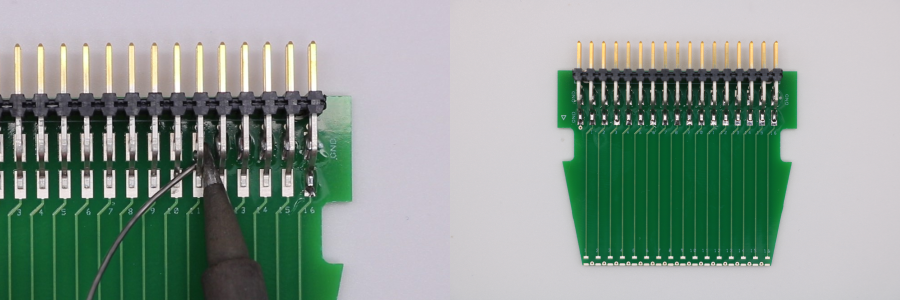
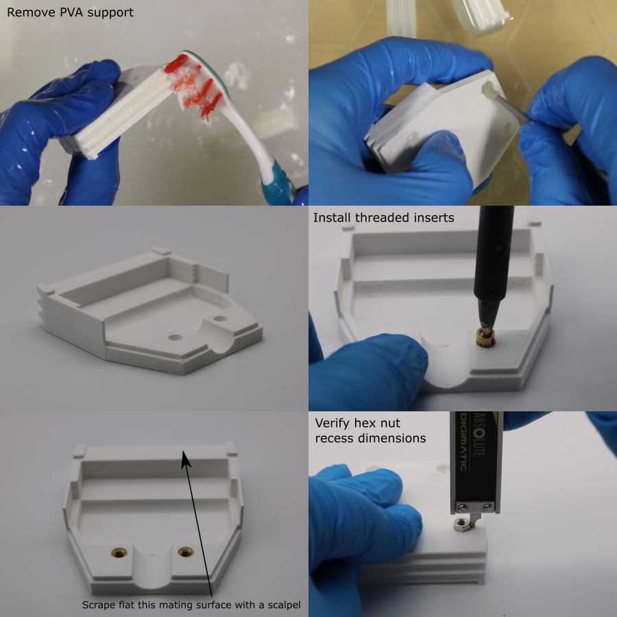
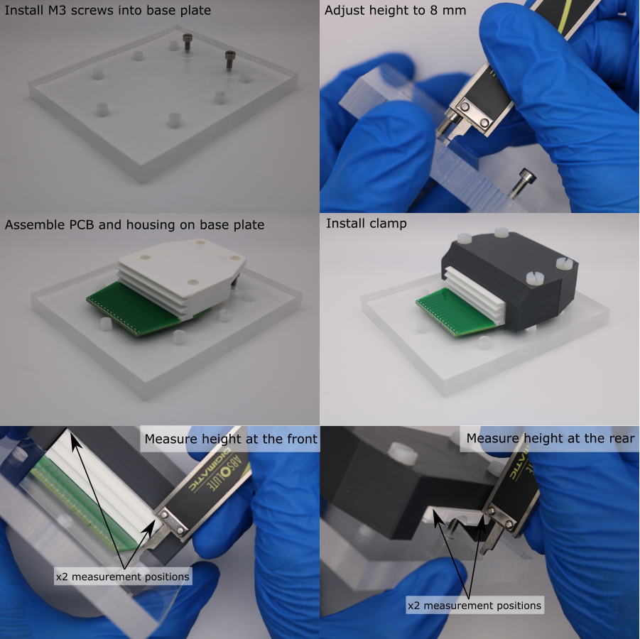
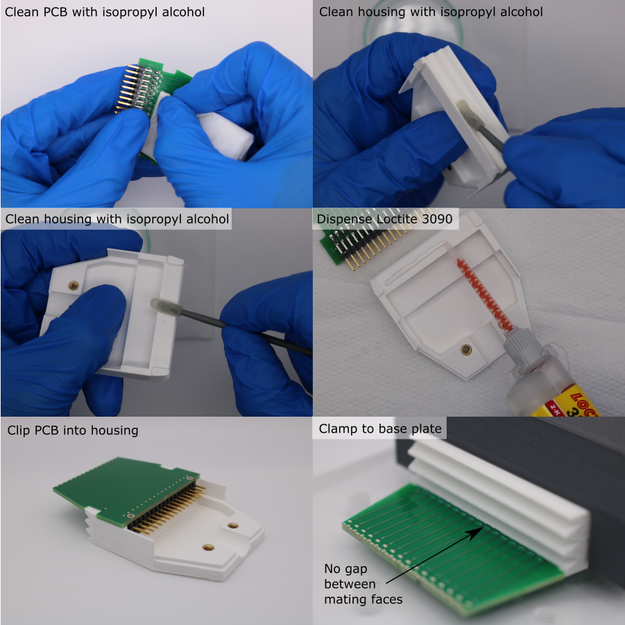

# PCB-Housing Assembly

## Overview

## Solder Interconnect PCB

1. Setup a soldering iron with a temperature of 350 degC and a small tip.
1. Position x1 Samtec header pin strip on the interconnect PCB. The edge of the insulating body should be flush with the upper edge of the PCB.
1. Solder the header pin strip to the PCB.

## Prepare the housing

`Note: residual PVA can be gently removed from the housing using a toothbrush and foam swabs. Do not use warm water since this can warp the housing.`

1. 3D-print the housing using the ...
1. Allow the parts to cool and remove from the build plate.
1. Remove the PVA support from the wedged structure on the front of the housings. Do not attempt to dig the PVA support out of the mounting nut recesses.
1. Place the housings in a bath of room temperature water for ~36 hours.
1. Install M3 threaded inserts into the housing, using a soldering iron set to 275 degC. Make sure to use a tip that does not protrude all the way through the insert, since this would melt a hole through the housing.
1. Use a scalpel to scrape flat the PCB mating face (the region between the two PCB alignment tabs).
1. Test fit the PCB-housing assembly (with the header pin strip facing the housing), to verify that the mating faces are in full contact.
1. Test that the hex nuts seat properly into the hex nut recesses. The hex nut should protrude from the surface by 2 mm. Discard the housing if this fetaure has a defect.

## Base plate setup

It is required that the PZT elements are aligned perpendicularly to the top surface of the transducer housing. To achieve this, the PZT elements are installed in the PZT alignment mould to align them perpendicularly with the base plate, which acts as a reference plane. The top surface of the housing is parallel with the surface of the base plate, which in turn means that it is perpendicular to the PZT elements. The following adjustment procedure is required to make the top surface of the housing parallel with the surface of the base plate:

1. Install M3 x 12 mm socket head screws into the threaded holes in the base plate.
1. The height of the top of the socket head above the base plate should be approximately 8 mm. Measure this using digital calipers and adjust if necessary (1 rotation advances the M3 screw by 0.5 mm).
1. Clip the PCB to the housing, and place the PCB flat against the base plate, with the housing resting on the socket screws.
1. Push 4 M5 x 30 mm screws through the clamp, into the threaded holes in the base plate. 
1. Tighten the screws to clamp the PCB-housing assembly to the base plate.
1. Use digital calipers to measure the distance between the top of the housing and the top of the base plate. Take two reference measurements at the front of the housing, and calculate the mean of these. This is the target value.
1. At the rear of the housing, record two height measurements: one beside each socket screw.
1. Calculate the difference between each rear measurement and the target value. This is the estimated height adjustment needed for each socket head screw.
1. Remove the clamp and PCB-housing assembly from the base plate, and adjust the screw heights.
1. Verify the adjustment by clamping the PCB-housing assembly to the base plate again, and re-measuring the heights.
1. Repeat this process until the 4 height measurements are within 25 \(\mu m\(.
1. Loosen the clamp screws so that the PCB-housing assembly can be removed. Leave the screws and clamp attached to the base plate, for the PCB-housing bonding. 

## PCB-Housing Bonding

Note: the Loctite 3090 has an extremely short work time, so these steps must be performed quickly. Make sure that everything is prepared before starting.

1. Degrease the mating faces on the PCB and the housing with isopropyl alcohol and a foam swab.
1. Fit a nozzle to the Loctite 3090 syringe barrel, squeezeout ~ 0.5 ml of adhesive and discard it.
1. Dispense a line of adhesive on the mating face of the housing.
1. Clip the interconnect PCB into place.
1. Quickly, place the PCB-housing assembly back on the base plate, sliding it underneath the clamp.
1. Tighten the screws so that the clamp pushes down on the housing.
1. Allow to cure for 1 hour. Do not remove the assembly from the base plate, since it is required for the rear electrode connection procedure.

