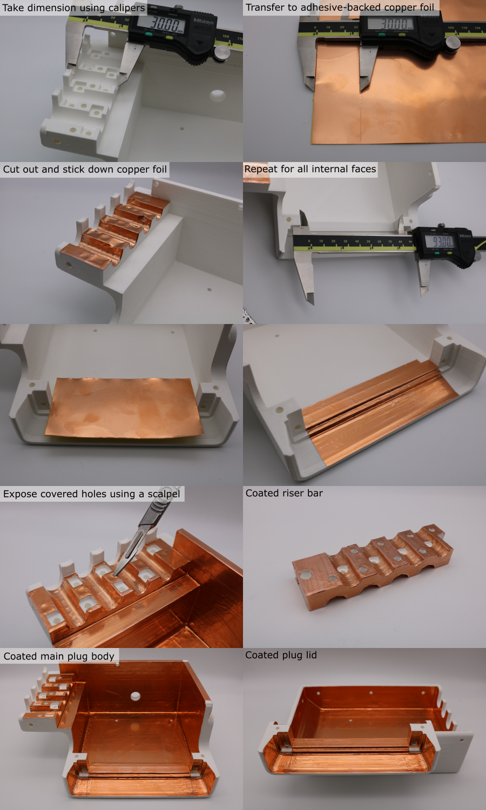
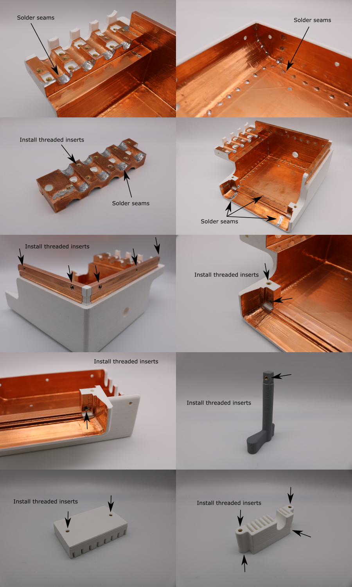
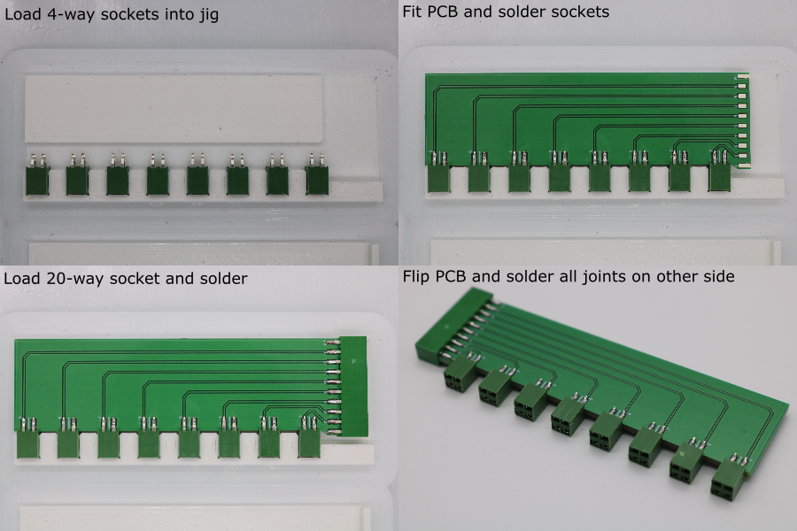
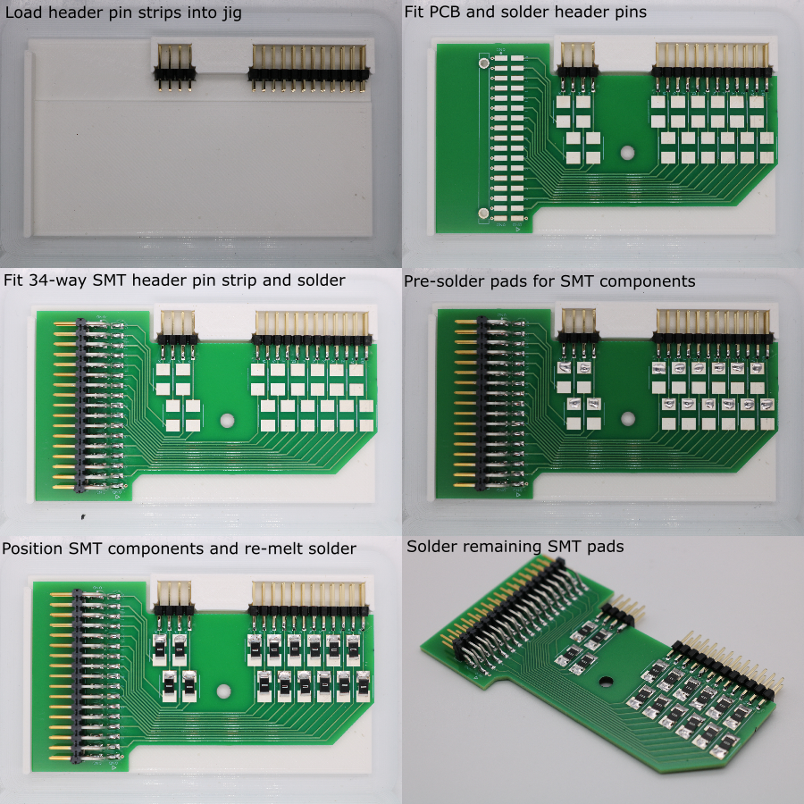
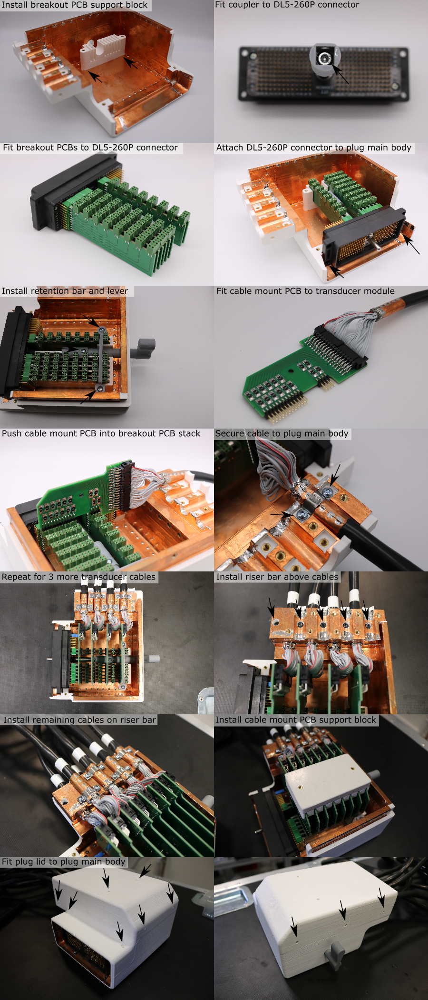

# Plug Assembly

## Overview

## 3D-Print the Plug Parts

1. 3D-print the plug parts (orientation and slicer settings detailed in [3D-print-spec.pdf](https://github.com/morganjroberts/open-UST/blob/main/hardware-distribution/3D-print-spec.pdf)).
1. Remove the support material, using a room temperature water bath for parts with PVA support.

## Copper Coating Backshell Parts

Coat the inner surfaces of the two halves of the split plug backshell, and the outside of the riser bar, using the following process:

1. Use calipers to take a dimension from the part.
1. Transfer these dimensions to a sheet of adhesive-backed copper foil.
1. Cut the required shape from the foil using scissors.
1. Remove the adhesive backing and stick the copper foil to the part. Overlap with previously applied pieces of copper. Push the foil all the way into corners using a hard object. Rub the seams to ensure good adhesion.
1. Repeat this until the parts are fully coated.
1. Use a scalpel to expose any covered holes.

## Finishing Backshell Parts

1. Setup a soldering iron with a temperature of 380 °C, with a large tip.
1. Apply solder joints to the seams between individual copper foil pieces to permenantly attach them. Space the joints every ~15 mm. Make sure that any loose flaps are tacked down with solder.
1. Setup a solering iron with a temperature of 275 °C, and a clean tip.
1. Use the soldering iron to install the threaded inserts so that they sit just below the surface of the part.

## Solder the DL5 Breakout PCB

1. Setup a soldering iron with a temperature of 350 °C and a small tip.
1. 3D-print the breakout PCB soldering jig (further details [here](custom-tooling-manufacture.md)).
1. Load x8 of the AMPMODU 4-way sockets into the soldering jig.
1. Place the breakout PCB into the soldeing jig, aligning the socket legs with the pads. Make sure the egde of the PCB is pushed squarely against the base of every socket.
1. Solder the sockets to the PCB. Use small solder joints and short heating times to prevent shorting the signal and ground pins.
1. Attach x1 of the AMPMODU 10-way sockets to the end of the PCB, aligning the socket legs with the pads. Make sure the edge of the PCB is pushed squarely against the base of the socket.
1. Solder the socket in place.
1. Flip the PCB and solder the joints on the other side.

## Solder the Cable Mount PCB

Note: If impedance matching is being used, the SMT component below refers to an inductor. If not, then the SMT component will be a zero-ohm link.

1. Setup a soldering iron with a temperature of 350 °C and a small tip.
1. 3D-print the cable mount PCB soldering jig (further details [here](custom-tooling-manufacture.md))
1. Load x1 8-way Wurth header pin strip and x1 24-way Wurth header pin strip into the soldering jig.
1. Place the cable mount PCB into the soldeing jig, aligning the socket legs with the header pins. Make sure the egde of the PCB is pushed squarely against the base of every header pin strip.
1. Solder the header pins to the PCB. 
1. Flip the PCB and solder the joints on the other side.
1. Position x1 Samtec header pin strip onto the PCB.
1. Solder the header pins to the PCB. 
1. To prepare for SMT component installation, apply a bead of solder to one pad for each of the SMT pad-pairs.
1. Use tweezers to position the SMT component above a pad-pair, and re-melt the solder to fix the component in place.
1. Solder the other end of the SMT component to its pad.

## Assemble the Plug Components

1. Attach the breakout PCB support block to the main plug body using two M3 x 10 mm screws.
1. Attach the coupler to the shaft of the DL5-260P connector using an M4 x 12 mm screw.
1. Push the breakout PCBs onto the DL5-260P connector pins.
1. Attach the DL5-260P connector to the main plug body using two M3 x 10 mm screws. Pay attention to the plug polarity, shown in the picture below. The breakout PCBs should fit into the grooves in the support block.
1. Attach the retention bar to fix the breakout PCBs to the support block, using 2 M3 x 6 mm screws.
1. Push the lever through the hole in the main plug body, into the coupler. Make sure the hole in the coupler aligns with the threaded insert on the end of the lever.
1. Secure the lever to the coupler using an M3 x 6 mm screw.
1. Install a cable mount PCB on to the end of each transducer module. Make sure that the polarity indicator (embossed triangle on IDC / red wire) is on the same side as the triangle printed on the PCB. The tab on the IDC connector should be facing away from the PCB.
1. Push the header pins on cable mount PCB 'A' into the sockets on breakout PCB stack.
1. Position a strain relief clip over the copper foil cable collar, and attach fix the cable to the main plug body using two M3 x 6 mm screws. The screw heads must sit below the surface.
1. Repeat this for every other transducer modules  ('C', 'E', and 'G').
1. Install the riser bar on top of the cables, using five M3 x 10 mm screws.
1. Repeat the cable mount PCB installation process for the remaining transducer modules ('B', 'D', and 'F').
1. Install the jumper shorting the DL5 connector pins A1 and A2.
1. Positon the cable mount pcb support block.
1. Place the plug lid over the plug main body. 
1. Make sure the holes in the support block are aligned with the holes in the plug lid, adjusting if necessary.
1. Fix the plug lid to the support block using two M3 x 10 mm screws.
1. Fix the plug lid to the DL5-260P connector using two M3 x 10 mm screws.
1. Fix the plug lid to the plug main body connector using six M3 x 10 mm screws, and two M3 x 30 mm screws.

