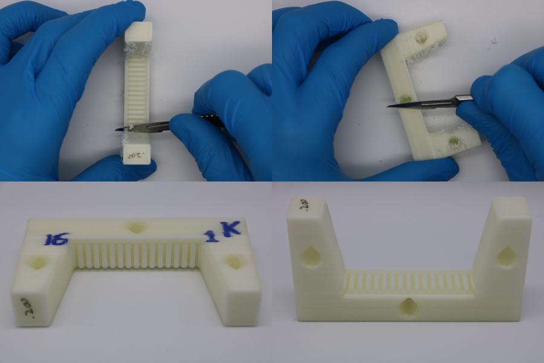
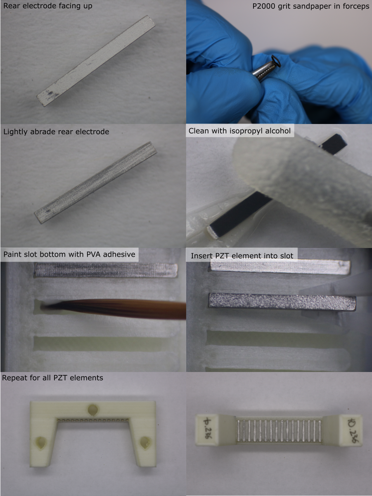
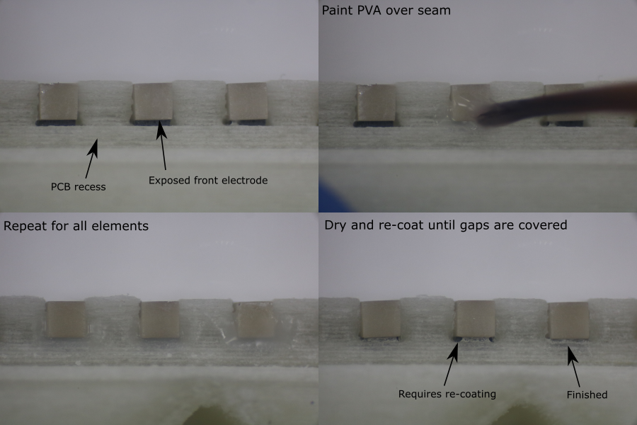

# PZT Element Alignment
<!-- Slot width affects orientation in lateral plane -->
<!-- elevation plane easier  -->

## Prepare Alignment Mould

1. From the width ordered list of PZT elements, select a batch of 20 PZT elements with a similar width, and make a list of their PZT ID's.
1. Calibrate the slot width for the PVA deposition mould (offset calibration process described [here](dimension-calibration-3D-printing.md#pzt-alignment-mould)). Adjust the required offsets in CAD and export the new stl file.
1. Print the stl file (orientation and slicer settings detailed in [3D-print-spec.pdf](https://github.com/morganjroberts/open-UST/blob/main/hardware-distribution/3D-print-spec.pdf)).
1. Label the part, marking the first (1) and last (16) element positions.
1. Allow the part to cool for 1 hour.
1. If the part is not being used immediately, store it in a sealed container to prevent dimensional changes due to humdity.
1. Cleanup nozzle stringing using a scalpel.
1. Use an air duster to blow debris out of the slots.

## Prepare and Load PZT Elements

1. Orient the alignment mould with the blind end of the slots on the left and the PCB recess on the right.
1. Identify the PZT element ID for the first position, and remove the PZT element from the PZT tray using tweezers,
1. Under a microscope, lightly abrade the surface of the rear electrode using a small piece of P2000 grit sandpaper held in a pair of forceps. Do not remove excessive material.
1. Clean all faces of the PZT element using isopropyl alcohol and a foam swab.
1. Place the element on a clean surface and allow the solvent to evaporate.
1. Using a fine brush, paint the bottom of the alignment mould slot with washable PVA adhesive. Apply a thin coat, avoiding the side walls (excess PVA could squeeze onto the rear electrode, preventing bonding to the backing layer).
1. Wash the brush in water.
1. Using plastic tweezers, slide the clean PZT element into the slot, with the matching layer facing down, and the exposed front electrode on the right hand side, above the PCB recess.
1. Apply gently pressure with the tweezers to fully seat the element onto the bottom of the slot. Make sure the element is pushed fully into the blind end of the slot.
1. Repeat this process for all elements in the transducer module.

## Apply PVA Blocking Layer

A PVA blocking layer is needed to prevent the backing layer composite from bonding to the exposed front electrode (this would later obstruct an electrical connection from the electrode to the PCB pad).

1. Under a microscope, apply a small drop of washable PVA adhesive to the end of the PZT element with a fine brush. Cover the gap between the alignment mould and the PZT element, where the matching layer has been removed to expose the front electrode. Do not cover the rear electrode.
1. Repeat this process for all elements in the transducer module.
1. Allow the adhesive to dry for 30 minutes.
1. Inspect the blocking layers. If the PVA adhesive does not completely block the gap next to the exposed electrode, apply a second blocking layer coat.

**Note:** if PVA adhesive is accidentally applied to the rear electrode, do not use solvent or water to remove it. Liquids can dissolve the surrounding PVA alignment mould and deposit a thin layer of PVA onto the rear electrode, preventing a proper bond between the electrode and the backing layer composite. Instead, allow the PVA adheisve to dry, then remove it using a small piece of P2000 grit sandpaper held in a pair of forceps. Remove the debris with an air duster.

