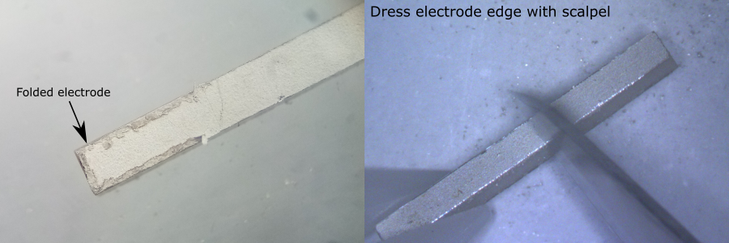
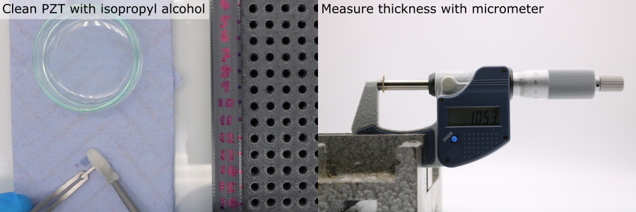
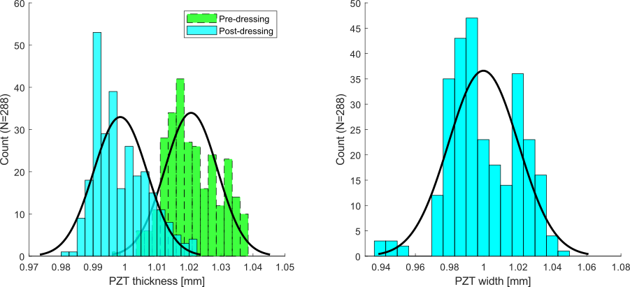

# PZT Element Preparation 

The PZT elements will each have slightly different widths and thicknesses, due to deviations from the nominal values given on the datasheet (tolerances provided by the manufacturer for these PZT elements were \(\pm\) 130 \(\mu m\) for width and \(\pm\) 25 \(\mu m\) for thickness, detailed in: [`Piezoelectric Element Tolerances - APC International.pdf`](https://github.com/morganjroberts/open-UST/blob/main/hardware-distribution/technical-datasheets/Piezoelectric%20Element%20Tolerances%20-%20APC%20International.pdf)). Also, some elements will have defects. 

In this section, these characteristics are measured and recorded. This information is important for several reasons:

* Defect classifications will be used later to select which elements should be used for the transducer modules. 
* The element widths are needed for calibrating the slot widths in the matching layer deposition mould, and the PZT alignment mould.
* If the unmatched and matched PZT element thicknesses are measured, these can be used to estimate the matching layer thicknesses (this data can be useful when interpretting inter-element variations in acoustic performance).

## Load the PZT Element Tray

To store and keep track of the PZT elements, a gridded tray has been designed. This is accompanied by spreadsheet [`pzt-element-dimensions-defects.xlsx`](https://github.com/morganjroberts/open-UST/blob/main/hardware-distribution/pzt-element-dimensions-defects.xlsx), where the data rows and columns correspond to the physical row and column locations on the PZT element tray. From now on, each PZT element should be identified by its row/column location e.g. 'A/3'.

1. Manufacture the PZT storage tray, according to XXX.
1. Load the tray with PZT elements, using plastic tweezers.
1. Use M3 x 12 mm screws to secure the lid to the tray for storage.

## Dress the PZT Electrode Edges

* During manufacture the individual PZT bars are cut from a large slab. Sometimes the silver electrodes are not cut neatly to the edge of the PZT.
* The excess PZT electrode material can fold over onto itself during shipping and handling.
* The excess electrode can affect the thickness measurement of the PZT elements and can prevent the PZT elements from seating properly on the bottom face of the slots in the PVA mould during matching layer deposition.
* To fix this, the electrode edges should be "dressed" by scraping away the excess electrode material.

**Note:** Perform this work underneath a microscope.

For each PZT element:  

1. Remove the PZT element from the tray using tweezers.
2. Hold the PZT element on a flat clean surface with the electrode facing upwards.
3. Use a scalpel blade (Swann-Morton No.11) to gently chamfer the edges of the electrodes. Do not apply excessive downwards pressure with the scalpel. Do not touch the face of the electrode with the scalpel.

## Meaure the PZT Element Dimensions

1. Setup a micrometer securely in a clamp on a workbench.
2. Clean the micrometer anvils using a foam swab (part ID XXX in [`bill-of-materials.xlsx`](https://github.com/morganjroberts/open-UST/blob/main/hardware-distribution/bill-of-materials.xlsx)) and isopropyl alcohol (part ID XXX in [`bill-of-materials.xlsx`](https://github.com/morganjroberts/open-UST/blob/main/hardware-distribution/bill-of-materials.xlsx)).
3. If using a digital micrometer, calibrate/tare it to 0.
4. For each PZT element:
    * Carefully handle the PZT element using tweezers (plastic to avoid electrode scratching)
    * Clean the PZT element using a foam swab and isopropyl alcohol.
    * Align the PZT element so that the electroded faces are parallel with the micrometer anvils.
    * Turn the ratcheting (rear-most) micrometer screw until it clicks.
    * Record the PZT element thickness
    * Rotate the element so that the non-electroded faces are parallel with the micrometer anvils.
    * Record the PZT element width
    * Gently drop the PZT element into the correct location in the PZT element tray, being careful not to scrape the PZT element against the hole wall.

**Note:** Re-clean the micrometer anvils using a foam swab and isopropyl alcohol every 10 PZT elements.

## Example Data

Width and thickness distributions were measured from the pool of PZT elements (N = 288) used for this project, using the procedure detailed above. Excess electrode folding was found to produce a systematic error in thickness measurement. A mean decrease of 22 \( \mu m \) was measured before and after dressing the electrode edges. The difference in standard deviation was negligible after dressing. In this case, the mean values for thickness and width match the nominal value provided by the manufacturer.

| Dimension                  | Mean [\( \mu m \)] | Standard Deviation [\( \mu m \)] |
| ---                        |    ----            |          ---                     |
| Thickness (Pre-dressing)   | 1021               | 8.2                              |
| Thickness (Post-dressing)  | 999                | 8.4                              |
| Width                      | 1000               | 20.4                             |

