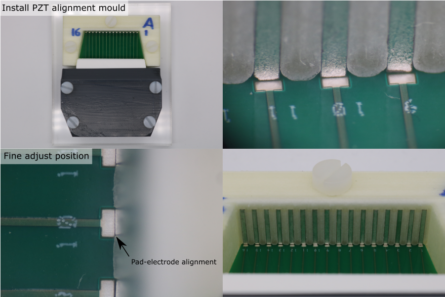
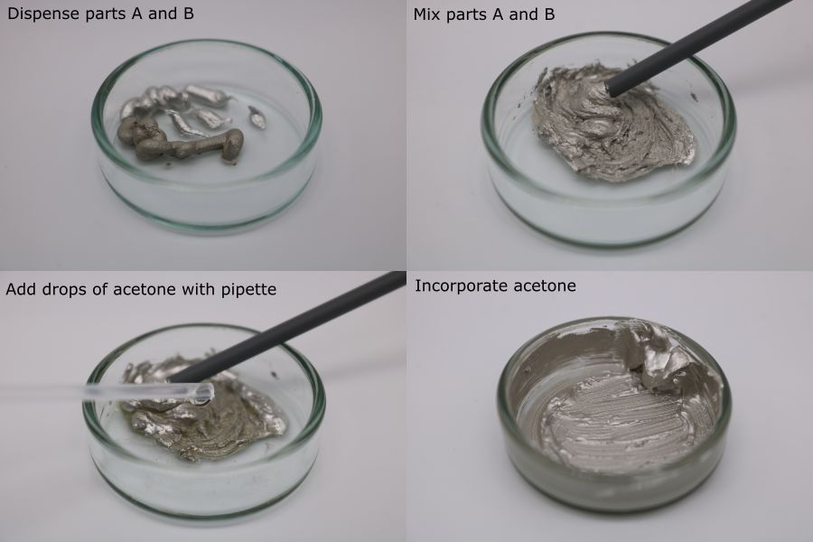
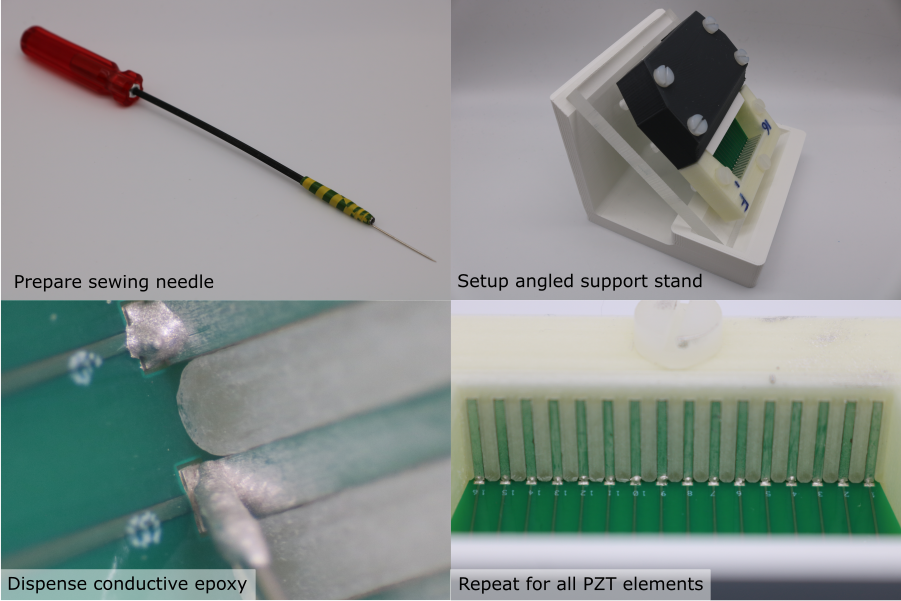

# Rear Electrode Connection

## PZT-Housing Registration

1. Place the pre-loaded alignment mould onto the base plate, so that the interconnect PCB fits into the alignment mould PCB recess.
1. Install the M5 x 20 mm nylon screws, through the alignment mould, into the base plate.
1. Tighten the screws so that the alignment mould is clamped but can be re-positioned.
1. Under a microscope, perform the final alignment. The rear electrode of every PZT element must be directly above the front edge of its corresponding PCB pad.
1. Tighten the screws fully.
1. Inspect the final alignment under a microscope to check that the parts have not shifted when the screws were tightened.
1. Use an air duster to blow any debris out of the cavity.

## Conductive Epoxy Preparation

**Note:** Dilution with acetone has only been verified with MG chemicals 8331-14G. If using a different conductive epoxy, prepare a test sample to check the effect of acetone ratio on viscosity, and to verify that diluting with acetone does not affect the electrical and mechanical properties after curing.

1. Place a glass petri dish on a digital balance (resolution should be 0.01 g or better) and tare it.
1. Dispense 0.5 g of conductive epoxy part A.
1. Tare the balance.
1. Dispense 0.5 g of conductive epoxy part B.
1. Mix part A and part B with a small plastic rod (e.g. the handle of a foam swab).
1. Place the petri dish on the balance and tare it.
1. Using a pipette, dispense 0.1 g of acetone.
1. Incorporate the acetone.

## Rear Electrode Connection

**Note:** The acetone evaporates from the mixture, increasing its viscosity. The effect of repeated dilution on the cured electrical properties of MG 8331-14G has not been tested. Instead, dispose of the mixture once it becomes too viscous to use, and prepare a new batch. Typically, it lasts for 15 minutes, which is enough time for ~3 transducer modules.

1. Place the module assembly on the angled support plate, under a microscope.
2. Prepare a dispensing tool - attach a sewing needle to a long rod using tape.
3. Collect a drop of diluted conductive epoxy on the needle tip.
4. Place the drop on the PCB pad, and move the needle tip in small circles so that the drop touches the rear electrode. The conductive epoxy should form a smooth fillet.
5. Repeat this process for all PZT elements in the transducer module.

Allow the conductive epoxy to cure for 24 hours. Once the conductive epoxy has cured, use a multimeter to check continuity between the conductive epoxy fillet and the rear electrode. Fix any defective joints if necessary.

**Note:** If the conductive epoxy is accidentally placed on the alignment mould, remove it after curing with a scalpel. If it is accidentally placed on the rear electrode, wipe off as much as possible with a foam swab, and any cured residue with a small piece of P2000 grit sandpaper held in a pair of forceps. In both cases remove any debris with an air duster.  Do not use solvents at any point, since they can dissolve the PVA alignment mould and deposit a thin layer of PVA on the rear electrode, preventing proper bonding with the backing layer composite.

