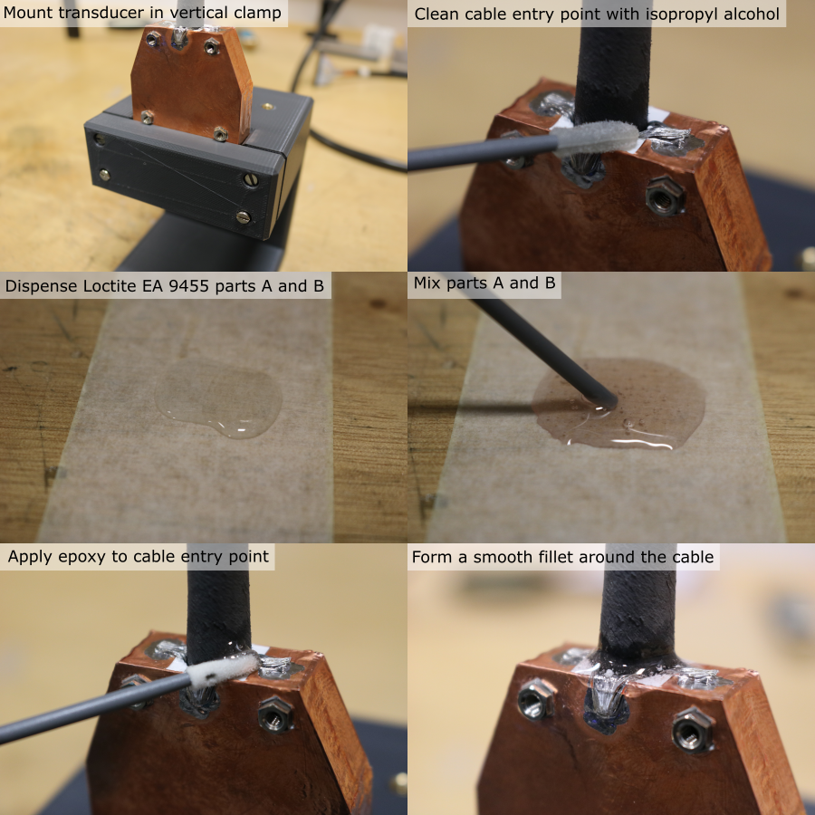
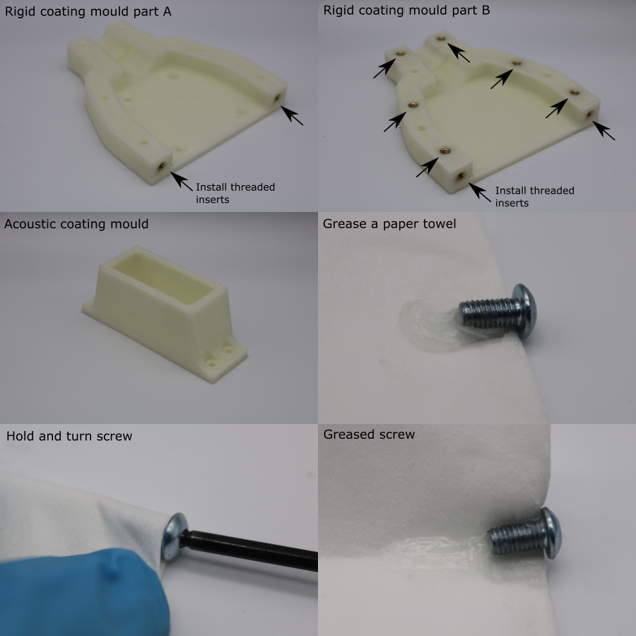
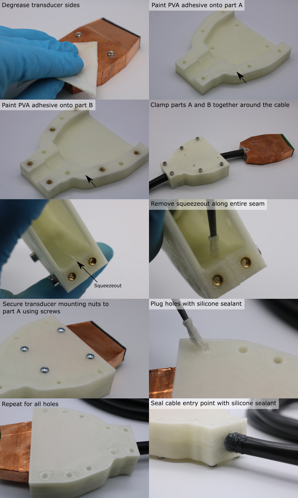
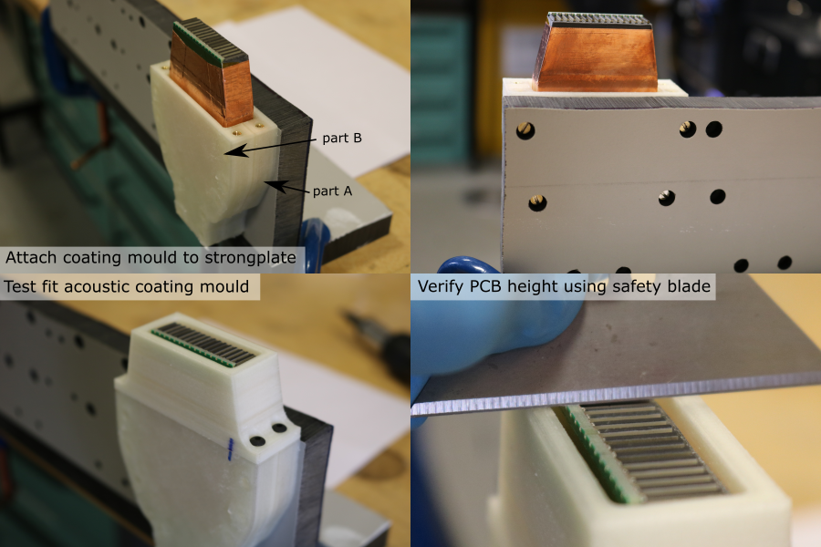
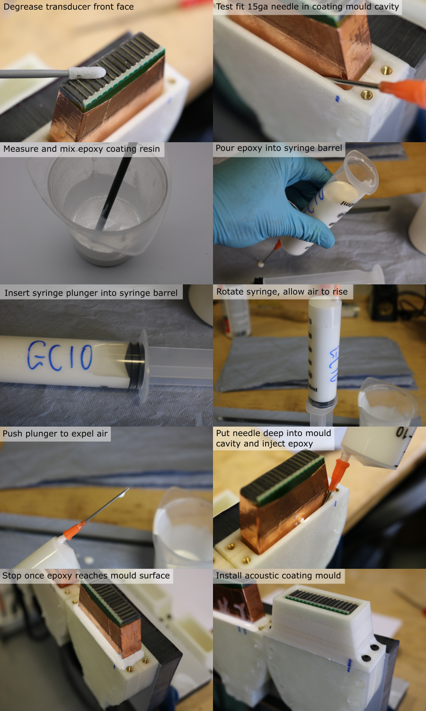

# Rigid Coating

## Overview
cable entry point needed to prevent coating leakage and backup waterproofing

## Seal cable-transducer entry point

1. Mount the transducer in the custom vertical clamp (see tooling page), taking care not to damage the PZT elements during handling.
2. Hold the cable in place vertically.
3. Clean the cable entry point and surrounding copper foil and braid using isopropyl alcohol and a foam swab.
4. Allow the solvent to evaporate.
5. Dispense equal parts (by volume) of Loctite EA9455 toughened epoxy onto a sacrificial piece of masking tape (~ 2 ml total).
6. Mix thoroughly for 1 minute using a small plastic rod, making sure all material is fully incorporated.
7. Use a foam swab to apply the epoxy to the cable entry point, forming a smooth fillet around the circumference. Make sure the joint completely covers the seam between the copper foil and the exposed housing region, to prevent leakage.

## Prepare coating moulds

1. 3D-print the coating mould parts.
2. Allow the parts to cool for 1 hour,
3. If the parts are not being used immediately, store them in a sealed container to prevent dimensional changes due to humdity,
4. Cleanup nozzle stringing using a scalpel,
5. Use an air duster to blow debris out of the parts.

6. Install M3 threaded inserts into the rigid coating split mould, using a soldering iron set to 275 degC. Make sure the top of the insert sits below the surface of the part to allow mating of the faces.
- Part A has x2 inserts
- Part B has x8 inserts
7. Use a scalpel to flatten any PVA squeezeout around the threaded inserts.
8. Use a paper towel, to apply a layer of vaseline petroleum jelly to the threads of the M3 x 6 mm socket head bolts.

## Assemble coating moulds

1. Degrease the sides of the transducer module using a paper towel soaked in isopropyl alcohol. Do not degrease the front face yet.
2. Use a fine paint brush to apply a bead of washable PVA glue onto the mating faces of each half of the rigid coating mould. 
3. Place the two halves of the mould either side of the transducer cable.
4. Install 6 M3 x 20 mm socket head screws through part A into the threads in part B to clamp the split mould together.
5. Use a foam swab to remove the PVA squeezeout inside the mould cavity, so that the internal mould seam is a smooth surface.
6. Allow the PVA adhesive to dry for 1 hour.
7. Remove the M3 x 20 mm clamping screws from the mould.
7. Pull the transducer module through the mould so that the mounting nuts are aligned with the corresponding holes in part A.
8. Install the greased M3 x 6 mm socket screws to attach the transducer module to the mould. Tighten the screws so that there is no epoxy leakage during coating.
9. Dispense silicone sealant onto a sacrificial paper towel.
10. Use a foam swab to plug all of the holes in the coating mould with silicone sealant.
11. Use a gloved finger to seal the cable entry point to the mould with silicone sealant. A thick layer is needed since the PVC-silicone bond is weak. A thin coat could easily peel away when the transducer is handled.
12. Allow the silicone to cure for 4 hours.

## Fix coating mould to strong-plate

13. Install M3 screws through the coating strong-plate and into the coating mould-transducer assembly (part A should be facing the strong-plate).
14. Tighten the screws so that part A is pulled flat against the strongplate.
15. Install the acoustic coating mould using M3 x 8 mm screws.
16. Use a safety blade to test the transducer-mould alignment. The PCB should be level with the top surface of the acoustic coating mould.
17. Remove the acoustic coating mould.
18. If the PCB was too low, reduce the height of the acoustic coating mould by lapping it on a sheet of P180 grit abrasive paper.

## Cast rigid coating

Note: the working time of gC10 is XX minutes, which is long enough that it this is not a limiting factor for the number of transducer modules that can be coated in one batch.

1. Use an air duster to remove debris from the front face of the transducer module.
2. Use a foam swab and isopropyl alcohol to degrease the front face of the transducer module.
3. Test the fit of the 15ga blunt needle in the coating cavity.
4. If the needle is slightly too large, compress it in a vice until it fits.
5. Tightly push the needle luer-slip fitting onto the 60 ml syringe body and remove the plunger.
5. Calculate the required mass of resin, hardener and pigment. For four transducer modules, the required volume is XXX ml, and the required quantities are:

Note: the pigment is for cosmetic purposes only. Omitting it will not affect the curing properties of the epoxy

| Component | Mass [g] |
|-----------|----------|
|Resin | |
|Hardener | |
|Pigment | |

Use the matlab function XXX to calculate the masses needed for other volumes and compositions.

6. Place a clean mixing pot on a digital balance (resolution 0.1 g or better), and tare it,
7. Dispense the required mass of resin,
8. Tare the balance.
9. Dispense the required mass of hardener,
10. Tare the balance.
11. Place the glass plate on the digital balance, and tare it,
12. Dispense the required mass of resin,
13. Tare the balance.
14. Dispense the required mass of pigment.
15. Use a plastic rod to mix the components together for 5 minutes. Frequently scrape down the walls and bottom of the pot to make sure that all of the material is fully incorporated.
16. Pour the mixture into the syringe barrel.
17. Holding the syringe horiztonally, push the plunger into the syringe barrel until it forms a seal, but no further.
1. Gently rotate the syringe so that it is vertical, with the needle facing up, and allow the mixture to settle and for the air to rise to the top.
19. Slowly push the plunger to expell all of the air from the syringe.
20. Place the needle into the coating mould cavity, as far down as it will go (it may be necessary to wiggle the needle if the fit is tight).
21. Gently push the syringe plunger to dispense the epoxy into the mould.
22. Once the epoxy has reached the top of the mould, gently remove the needle from the mould
23. Wait for 10 minutes to check that the epoxy is not internally into the transducer module, indicated by the level going down without visible external leaking (see note below).
24. Place the acoustic coating mould over the exposed transducer module.
25. Install 4 M3 x 8 mm screws to secure the acoustic coating mould to the rigid coating mould.
26. Allow to cure for 24 hours.

Note: If the epoxy is leaking internally, it will leak into the cable, making the cable rigid when the epoxy cures, which should be avoided. To stop the leak, use the needle and a new syringe to suck as much epoxy as possible out of the mould, wait for the epoxy to cure (this will seal the leak) and start the coating process again with a new batch of epoxy.

Note: be careful not to touch the front face of the transducer with the epoxy. If this happens, remove it immediately and rinse thoroughly with isopropyl alcohol.

