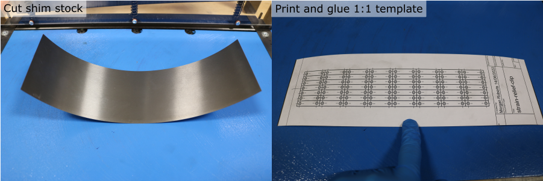
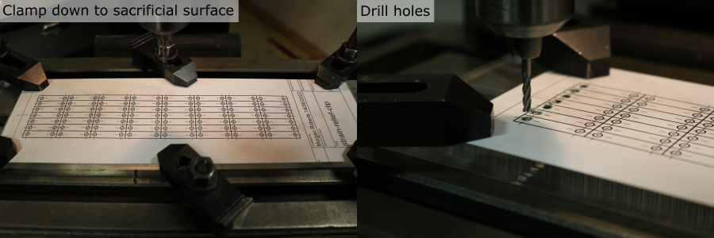
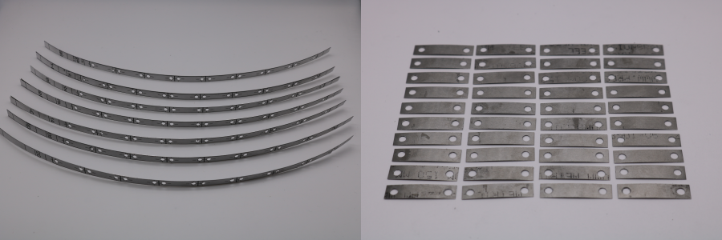
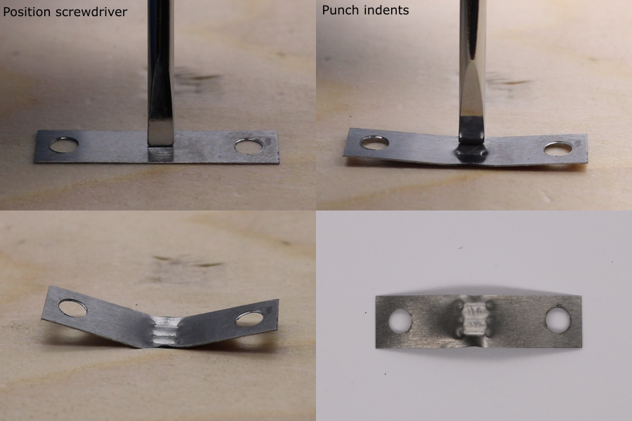
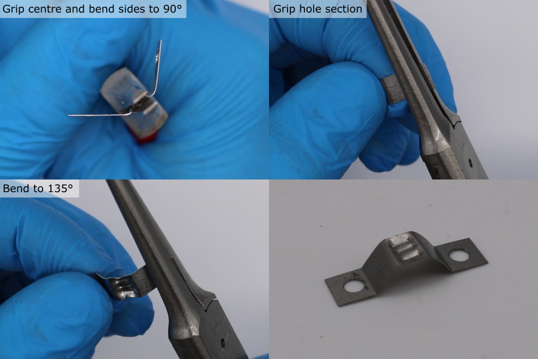

# Strain Relief Clip Manufacture

## Overview

The strain relief clips are used to:
* secure the cable to the transducer module housing,
* secure the cable to the plug backshell.

## Mark hole and outline locations

1. Download and print the template `placeholder`
2. Cut a piece of 0.2 mm steel shim stock slightly larger than the template printout.
3. Use a pritt stick adhesive to fix the paper template to the steel sheet.

**Note:** If marking the hole and outline locations manually, use the following dimensions: (from )
**Note:** Make more clips than required to allow for defects.

## Drill holes

1. Clamp the steel sheet to a sacrificial flat surface e.g. perspex
2. Mount a 3 mm flat end mill in a drill press or mill.
3. Align the end mill with one of the template holes
    * **Note:** this is easiest when using a milling machine where the table position can be fixed, or adjusted in the x and y positions.
3. Use a RPM of XX and light pressure to make a hole.
    * **Note:** Remove any chips stuck to the cutting face of the end mill before the next hole.
4. Repeat for all the hole locations.

## Cut individual clip blanks

1. Use a guillotine or scissors to cut the outlines, forming individual clip blanks

## Form the indents

1. Position a flat head screwdriver in the centre of the clip blank and hit it with a hammer to form an indent
2. Repeat this with the screwdriver re-positioned above and below the first dent.

**Note:** if the screwdriver punctures the blank, discard it.

## Shape the wings

1. Use flat long nose pliers to grip the centre section of the clip.
2. Bend the sides around the pliers to form an overall angle of approximately 90 degrees.
3. Re-position the pliers to cover one of the holes.
4. Bend the wing to an angle of approximately 135 degrees
5. Repeat for the other wing.

