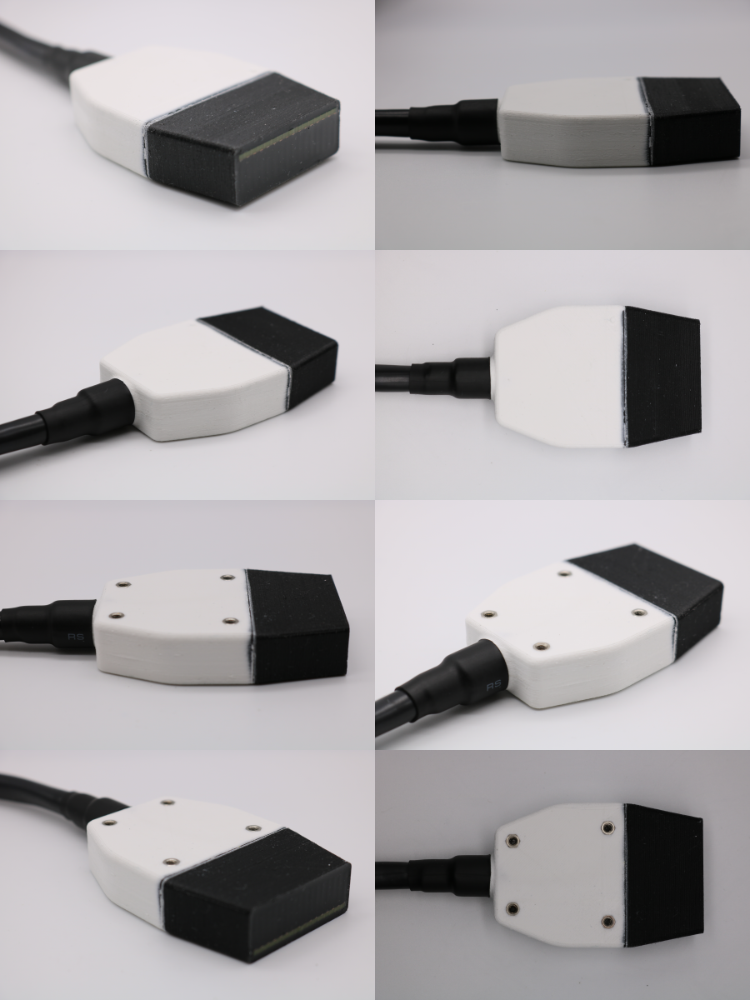

# Transducer Array Description

Each transducer module is a 16-element linear array, with complete electromagnetic shielding and waterproofing. The standard 256-element open-UST imaging system is formed by assembling 16 of these modules into a ring array.

Each module has the following specifications:

- Ring array diameter: 220 mm
- PZT elevation height: 10 mm
- PZT lateral width: 1 mm
- PZT thickness: 1 mm
- PZT pitch: 2.54 mm
- Transmit-receive beamwidth at z = 110 mm: 8.1 mm (-6 dB)
- Opening angle: 44.7 deg (-6 dB)
- Centre frequency: 1.21 MHz
- Fractional Bandwidth: 75 % (-20 dB)

## Further Reading

- M. Roberts, E. Martin, M. Brown, B. Cox and B. Treeby, "Transducer Module Development for an Open-Source Ultrasound Tomography System," 2021 IEEE International Ultrasonics Symposium (IUS), 2021, pp. 1-4, doi: [10.1109/IUS52206.2021.9593866](https://doi.org/10.1109/IUS52206.2021.9593866)
- M. Roberts, E. Martin, M. Brown, B. Cox and B. Treeby, "Matching Layer Deposition for an Open-Source Ultrasound Tomography System: Inter-Element Variation in Frequency Response," 2022 IEEE International Ultrasonics Symposium (IUS), 2022, pp. 1-4, doi: [10.1109/IUS52206.2021.9593866](https://doi.org/10.1109/IUS52206.2021.9593866)

